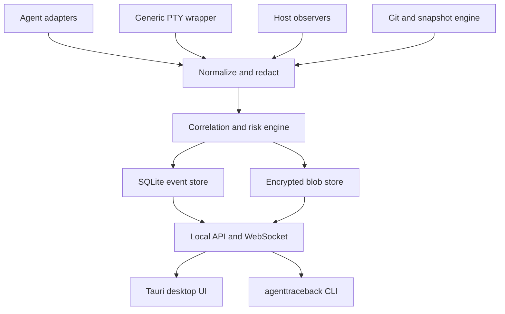
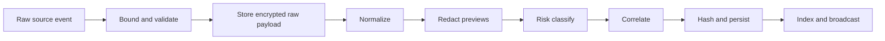
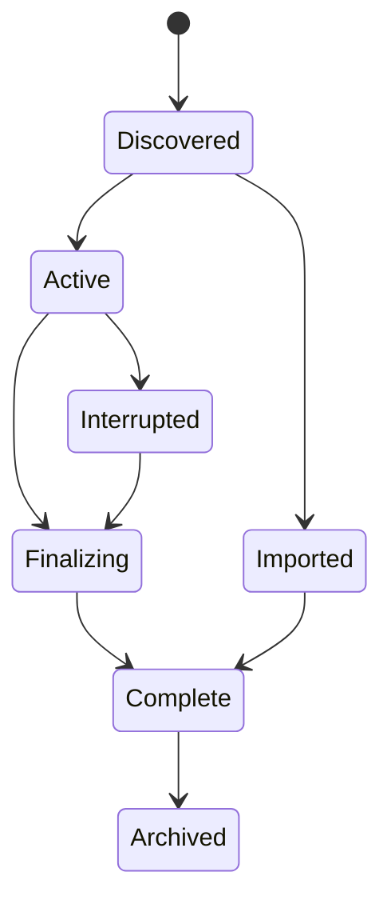

# AgentTraceback: Definitive Local Record and Recovery Tool for AI Agent Runs

**Implementation specification and execution plan**

| Field | Value |
| --- | --- |
| Document status | Approved build blueprint |
| Specification version | 1.0 |
| Target release | Public v0.1.0 |
| Product name | AgentTraceback |
| Repository name | `agenttraceback` |
| Primary binary names | `agenttraceback`, `agenttracebackd` |
| License | Apache-2.0 |
| Last updated | 2026-09-20 |

> Use `AgentTraceback` in user-facing copy and `agenttraceback` in package, command, path, and protocol names. Position the product as a verified record and recovery tool for AI coding-agent runs, not as a guard, blocker, or generic activity dashboard.

---

## Document map

- [Directive and product definition](#0-directive-to-the-implementation-agent)
- [Locked decisions and v0.1 scope](#2-locked-decision-registry)
- [Evidence and truth model](#4-evidence-and-truth-model)
- [Architecture, repository, and data model](#5-system-architecture)
- [Storage, encryption, and integrity](#8-local-storage-encryption-and-integrity)
- [Standard capture and agent adapters](#9-standard-capture-architecture)
- [Search, recovery, and usage semantics](#12-search-and-query-behavior)
- [Desktop UX specification](#15-desktop-product-and-ux-specification)
- [Local API, CLI, and platform contracts](#16-local-api-contract)
- [Reliability, security, performance, and testing](#19-reliability-and-failure-behavior)
- [Packaging and implementation milestones](#23-build-packaging-and-release)
- [Release gates and roadmap](#25-public-v01-release-gates)
- [Definition-of-done scenarios and issue backlog](#30-definition-of-done-scenarios)
- [Coding-agent handoff prompt](#32-handoff-prompt-for-the-coding-agent)

---

## 0. Directive to the implementation agent

This document is the implementation contract. Implement it in the order given.

The product, scope, architecture, evidence semantics, safety model, technology stack, storage model, UX structure, and v0.1 release gates are already decided. Do not replace them with alternate architectures, reduce the release to a proof of concept, or ask the owner to choose between competing frameworks.

When a low-level implementation detail is not explicitly prescribed:

1. Choose the smallest conventional implementation consistent with this specification.
2. Record the choice in `docs/adr/` as a short architecture decision record.
3. Keep public interfaces versioned and replaceable.
4. Continue unless the choice would change a locked product decision, weaken a security guarantee, or make recorded evidence less truthful.

If blocked by an upstream format or operating-system limitation, do not fake support. Implement capability detection, degrade honestly, expose the limitation in the UI, add a fixture-backed test for the degraded state, and continue with the remaining work.

Required execution behavior:

- Work milestone by milestone. A milestone is complete only when its acceptance tests pass.
- Keep the application runnable at the end of every milestone.
- Use real persisted data in production paths. Mock data is allowed only in tests, Storybook-equivalent development surfaces, and explicit `agenttraceback demo` mode.
- Never label an event `VERIFIED` unless two independent sources actually corroborate it.
- Never modify an agent's configuration without explicit one-click user consent and a reversible backup.
- Never overwrite a user's workspace as the default recovery action.
- Never add cloud dependencies, accounts, analytics, or remote content loading to v0.1.
- Do not implement kernel drivers, Endpoint Security extensions, eBPF enforcement, filesystem minifilters, or blocking policy enforcement in v0.1.
- Do create the interfaces that allow those deep-capture modules to be added later.
- Commit generated lockfiles and database migrations.
- Treat Linux, macOS, and Windows as first-class targets throughout development, not as a final porting phase.

---

## 1. Product definition

### 1.1 One-sentence definition

AgentTraceback is a local-first, cross-platform verified record and recovery tool for AI coding-agent runs that shows what every agent reported, what the computer independently observed, what changed, what was risky, and how to recover safely.

### 1.2 Positioning

**Tagline:** Every agent. Every action. One timeline.

**Core positioning statement:**

> Agent telemetry tells you what the agent says it did. AgentTraceback shows what actually happened and exactly how it knows.

### 1.3 The four product promises

1. **Everything understandable is visible.** Sessions, prompts, responses, tool calls, subagents, commands, processes, file activity, diffs, Git state, test results, model usage, token usage, estimated cost, warnings, and recovery points appear in one coherent interface.
2. **Evidence provenance is explicit.** Every meaningful event is labeled `REPORTED`, `OBSERVED`, or `VERIFIED`. The product never presents all telemetry as equally trustworthy.
3. **The product is local by default.** No account, API key, cloud service, external database, telemetry collector, or hosted dashboard is required. Source code and session contents stay on the machine.
4. **Recovery is first class.** Users can inspect before/after state, restore a file, reconstruct the state before a session, or create a recovery branch or directory without blindly overwriting current work.

### 1.4 Primary users

| User | Problem | Required outcome |
| --- | --- | --- |
| Heavy individual agent user | Runs several agents and cannot remember which changed what | One live and historical timeline across all agents |
| Developer debugging a regression | Knows an agent introduced a failure but not when or how | Search file/command/test history and compare before/after state |
| Engineering lead | Needs accountable, reproducible agent activity | Session summaries, evidence provenance, exports, and deterministic history |
| Security engineer | Needs to know whether an agent accessed sensitive files or executed risky commands | Sensitive-path warnings, process ancestry, evidence integrity, and redacted exports |
| Regulated organization | Needs an auditable who/what/when/where/why/result record | Append-only evidence chain and exportable evidence bundles |

### 1.5 The core loop

1. User installs and opens AgentTraceback.
2. AgentTraceback detects supported agents and historical sessions.
3. User enables read-only import and, optionally, richer live hooks.
4. AgentTraceback imports useful history immediately.
5. New sessions appear live, whether launched normally through a supported adapter or through `agenttraceback run -- ...`.
6. The user opens a session to see its conversation, timeline, files, commands, processes, Git state, risks, and recovery options.
7. The user searches across all history or safely reconstructs an earlier state.

### 1.6 Public v0.1 outcome

The first public release must feel like a product, not a tracing demo. A new user should install it, see detected agents, import prior sessions, and reach a useful timeline in under two minutes without configuring YAML, Docker, Grafana, OpenTelemetry, an account, or an API key.

---

## 2. Locked decision registry

The following decisions are final for v0.1.

| Area | Decision |
| --- | --- |
| Product model | Independent local recorder plus semantic agent adapters |
| Core language | Rust, stable toolchain, Rust 2024 edition |
| Async runtime | Tokio |
| Rust serialization | Serde |
| CLI parsing | Clap derive API |
| Internal logging | `tracing` and `tracing-subscriber` |
| Desktop shell | Tauri 2 |
| Frontend | React 19 with TypeScript in strict mode |
| Frontend build | Vite and pnpm workspaces |
| UI primitives | Radix UI primitives, Tailwind CSS, Lucide icons |
| Client data | TanStack Query, TanStack Router, TanStack Table/Virtual; Zustand only for transient UI state |
| Code and diff display | Monaco Editor, loaded locally |
| Recorder process | Per-user background daemon named `agenttracebackd` |
| CLI | Rust binary named `agenttraceback` |
| Local API | Versioned REST plus WebSocket on loopback with a per-install bearer token |
| Metadata database | SQLite in WAL mode with FTS5 |
| SQLite access | `rusqlite` with bundled SQLite, a dedicated writer actor, and bounded blocking read workers |
| Recovery content | Content-addressed encrypted blob store, Zstandard compression |
| Blob identity | BLAKE3 digest of plaintext content |
| Event integrity | SHA-256 hash chain over canonical normalized events and raw-payload digests |
| IDs | UUIDv7 |
| Time | UTC microseconds in storage; local time in UI; monotonic clock retained when available |
| Default mode | Observe and warn, never block |
| Cross-platform contract | Excellent unprivileged standard mode on Windows, macOS, and Linux |
| Deep OS capture | Post-v0.1 optional modules with elevated privileges or platform entitlements |
| Default network behavior | No outbound connections except explicit user-initiated update checks or link opens |
| Telemetry | None in v0.1 |
| Account | None |
| Update channel | Signed GitHub Releases through Tauri updater, user initiated by default |
| License | Apache-2.0 |
| Recovery default | Restore to a new directory or recovery branch; in-place restore is advanced and guarded |
| Git implementation | Invoke the installed Git CLI with structured argv; do not use libgit2 |
| Diff implementation | Rust `similar`-family text diff behind an internal interface; Monaco renders the result |
| Branding | Canonical product name is `AgentTraceback` |

### 2.1 Required v0.1 agent coverage

| Agent or harness | v0.1 requirement |
| --- | --- |
| Claude Code | Historical import, live tailing, and implemented official hook integration; enabling the hook remains optional to the user |
| OpenAI Codex CLI | Historical import and live tailing from local session records |
| Hermes Agent | Historical import and live tailing from its local state/database |
| OpenCode | Historical import and live tailing from local storage |
| Gemini CLI | Historical import and live tailing from local chat/session files |
| Command Code | First-class detection/profile plus generic wrapper capture; semantic import when a stable local format is discoverable |
| Any CLI agent | Full generic wrapper session through `agenttraceback run -- <command>` |

Cursor, Windsurf, Cline, Aider, and additional agents are v0.2 targets. Their absence must not delay v0.1.

### 2.2 Supported desktop platforms for v0.1

| Platform | Required builds | Minimum supported version |
| --- | --- | --- |
| Windows | x86_64 WiX MSI and portable ZIP | Windows 10 22H2 or Windows 11 |
| macOS | Universal arm64/x86_64 app and DMG | macOS 13 Ventura |
| Linux | x86_64 AppImage and `.deb`; tarball fallback | Ubuntu 22.04-equivalent glibc baseline |

Linux arm64 and Windows arm64 are post-v0.1.

---

## 3. Scope and release boundaries

### 3.1 Required public v0.1 features

- Cross-platform desktop application and CLI.
- Per-user daemon with automatic startup controlled by the user.
- Agent auto-detection and capability matrix.
- Historical import for the five required semantic adapters.
- Live tailing for supported local session formats.
- Generic interactive CLI wrapper that preserves terminal behavior and exit codes.
- Live dashboard across concurrent agents and projects.
- Session timeline with expandable raw evidence.
- Conversation view with prompts, responses, tool calls, and subagent relationships when the source exposes them.
- File create, modify, delete, and rename activity within recorded project scopes.
- Before/after hashes, text diffs, and binary metadata.
- Git state before and after each recorded session.
- Best-effort process ancestry in standard mode.
- Command and test-result recognition.
- Token/model/provider metadata and clearly labeled cost estimates when possible.
- Global full-text and structured search.
- File history across agents and sessions.
- Secret redaction for search, previews, logs, and exports.
- Sensitive-path and dangerous-command warnings.
- Append-only event hash chain and session root verification.
- Individual file restore.
- Exact eligible pre-session reconstruction to a new directory.
- Safe Git recovery branch/worktree flow when possible.
- Redacted JSON evidence export and human-readable Markdown report export.
- Storage management, retention visibility, and capture-health indicators.
- Polished onboarding, empty states, keyboard navigation, dark/light themes, and accessible UI.

### 3.2 Explicitly deferred to v0.2 or later

- Kernel-level or security-extension deep capture.
- Definitive host-observed file-read telemetry in standard mode.
- Host-observed socket/network telemetry in standard mode.
- Enforcement, blocking, approvals, or Guard Mode.
- Sandboxing or containerization of agents.
- MCP server.
- OpenTelemetry export.
- Natural-language search that requires a model.
- Team synchronization, hosted dashboards, SSO, RBAC, or centralized policy.
- Remote machines.
- IDE extension marketplace.
- Third-party dynamically loaded adapter plugins.
- Mobile apps.
- Automated agent-quality scoring presented as objective truth.

### 3.3 Non-goals

AgentTraceback v0.1 is not:

- An antivirus or EDR replacement.
- A sandbox.
- A process blocker.
- A hosted observability service.
- A full terminal emulator product.
- A source-control replacement.
- A guarantee that every file read or network connection is visible without deep capture.
- A mechanism for retaining hidden model reasoning.
- A tool that silently injects itself into every program on the machine.

---

## 4. Evidence and truth model

Evidence provenance is the primary differentiator and must be represented consistently in storage, APIs, exports, and UI.

### 4.1 User-facing evidence classes

| Badge | Definition | Examples |
| --- | --- | --- |
| `REPORTED` | A source associated with the agent says the event occurred | Claude hook tool call, Codex rollout event, Hermes database record |
| `OBSERVED` | AgentTraceback independently observed an effect or execution | PTY command launch, file-monitor change, process discovery, Git state transition |
| `VERIFIED` | A reported event and an independent observation match under deterministic correlation rules | Agent reports writing `src/auth.ts`, file observer sees the same path change, and resulting hash agrees |

Never upgrade a reported event to verified solely because two fields within the same agent log agree. Independent evidence must come from a separate source boundary.

Storage and API distinction:

- A **source event** is one immutable normalized record from one authority. Its stored class is `REPORTED` or `OBSERVED`.
- A **logical timeline event** is the API/UI projection of one source event or a correlated group of source events.
- A logical timeline event displays `VERIFIED` only while an active append-only correlation record joins at least one reported source event to at least one observed source event.
- The evidence drawer always exposes the constituent source events. Exports include both the logical projection and source IDs.

### 4.2 Internal source kinds

Every event stores one source kind:

- `agent_log`
- `agent_hook`
- `wrapper`
- `filesystem_observer`
- `process_observer`
- `git_observer`
- `user_action`
- `policy_engine`
- `importer`

`importer` describes the ingestion path, not the original authority. Imported source events must also retain their original source kind.

Source-to-evidence mapping:

| Source kind | Stored source evidence |
| --- | --- |
| `agent_log` | `REPORTED` |
| `agent_hook` | `REPORTED` |
| `wrapper` | `OBSERVED` for the wrapper launch/PTY stream only |
| `filesystem_observer` | `OBSERVED` |
| `process_observer` | `OBSERVED` |
| `git_observer` | `OBSERVED` |
| `user_action` | `OBSERVED` as an action inside AgentTraceback |
| `policy_engine` | No independent evidence upgrade; findings inherit and cite their underlying source events |
| `importer` | Inherit the original source kind; importer status alone proves nothing |

Two agent-controlled sources remain reported evidence. For example, a Claude hook and Claude's own JSONL log do not independently verify one another.

### 4.3 Attribution confidence

Provenance and attribution are separate. An event can be genuinely observed but ambiguously attributable.

| Confidence | Meaning |
| --- | --- |
| `exact` | Stable session ID, process ancestry, or adapter event directly links the event |
| `high` | One active session owns the wrapper/process scope and path/time/hash agree |
| `medium` | Time and project scope agree but more than one writer is possible |
| `low` | Heuristic association only |
| `unattributed` | Event is real but cannot be assigned to a session safely |

The UI must expose the confidence in a tooltip or evidence drawer. Low-confidence events do not participate in `VERIFIED` status.

### 4.4 Correlation rules

Correlation is deterministic and versioned.

An agent-reported file mutation may become `VERIFIED` only when all of the following are true:

1. Same normalized project and path.
2. Same action family: create/write/delete/rename.
3. Event times differ by no more than 2 seconds by default.
4. The observed event belongs to the same exact or high-confidence session scope.
5. If both sides have an after-hash, the hashes match.
6. No conflicting candidate has equal or stronger evidence.

For tools that write files in batches, the correlation window may expand to 10 seconds only when a shared tool-call ID or exact process subtree exists.

Commands may become `VERIFIED` only when an agent tool call and an independently observed process or wrapper execution agree on executable and normalized arguments. Redacted argument values are compared through keyed digests, not plaintext.

When sources disagree:

- Preserve both source events.
- Create a `correlation_conflict` record.
- Show a visible `Mismatch` warning.
- Do not silently choose one source.
- Keep the host-observed effect as the stronger description of machine state, without deleting the agent report.

Correlation records are immutable, versioned, and included as their own integrity-chain entries. A later parser improvement may append a superseding correlation record, but it never edits the earlier source events or correlation evidence.

### 4.5 Capability truthfulness

Every adapter and platform reports capabilities rather than a single supported/unsupported boolean:

- Historical sessions
- Live sessions
- Prompts
- Responses
- Tool calls
- Commands
- File reads
- File writes
- Subagents
- Tokens
- Cost metadata
- Process ancestry
- Host-observed writes
- Host-observed reads
- Host-observed network
- Recovery snapshots

The onboarding and Settings screens display this matrix. Unavailable evidence is shown as unavailable, never as an empty successful capture.

---

## 5. System architecture



### 5.1 Runtime processes

#### `agenttracebackd`

The per-user daemon owns:

- Adapter discovery, import, and tailing.
- Generic wrapper session registration.
- Filesystem and process observers.
- Project baseline and snapshot creation.
- Event normalization, redaction, risk analysis, correlation, and persistence.
- Hash-chain creation and verification.
- Search indexing.
- Recovery and export jobs.
- REST and WebSocket API.
- Storage retention and health state.

Only one daemon instance may own a data directory. Use an OS-level lock and return the existing endpoint when a second instance starts.

#### `agenttraceback`

The CLI is a thin client plus wrapper launcher. It must support:

- Starting, stopping, and querying the daemon.
- Launching a recorded CLI session.
- Listing and showing sessions.
- Searching history.
- Verifying event chains.
- Exporting evidence.
- Running restore/recovery jobs with confirmations.
- Printing adapter and capture diagnostics.
- Explicit demo-data mode.

#### Desktop application

The Tauri application:

- Starts or connects to the daemon.
- Bridges authenticated local API requests.
- Renders the complete user experience.
- Does not duplicate event normalization or storage logic.
- Can be closed while recording continues if background recording is enabled.

### 5.2 Local API transport

Use `axum` in `agenttracebackd`.

- Bind only to `127.0.0.1` on a random available port.
- Create a 256-bit random bearer token on first run.
- Store connection metadata in a runtime file readable only by the current user.
- Require the token on every HTTP and WebSocket request.
- Reject browser origins other than the Tauri origin allowlist.
- Reject requests with missing or unexpected `Host` headers.
- Never bind to `0.0.0.0` or a LAN interface.
- Rotate the token through Settings and on suspected permission failure.
- Version all endpoints under `/api/v1`.
- Use WebSocket `/api/v1/live` for live event, import-progress, job-progress, and capture-health messages.

Runtime metadata paths:

| OS | Path |
| --- | --- |
| Linux | `$XDG_RUNTIME_DIR/agenttraceback/runtime.json`, fallback `$XDG_STATE_HOME/agenttraceback/runtime.json` |
| macOS | `~/Library/Application Support/AgentTraceback/runtime.json` |
| Windows | `%LOCALAPPDATA%\\AgentTraceback\\runtime.json` |

The runtime file contains only PID, port, token, daemon version, and API version. Enforce mode `0600` on Unix and current-user ACL on Windows.

### 5.3 Event pipeline



Rules:

- Raw inputs are untrusted and size-bounded before parsing.
- Raw source material is retained as an encrypted blob when capture policy permits.
- Search and UI preview fields contain redacted text only.
- Normalization never deletes the raw source payload.
- Persistence and hash-chain advancement occur in one transaction.
- A failed adapter or parser cannot stop other pipelines.
- Backpressure is bounded. If a queue fills, spill valid framed raw events to a crash-safe local spool and emit a visible capture-health warning.

---

## 6. Repository and module layout

Use a Cargo workspace and pnpm workspace in one repository.

```text
agenttraceback/
  Cargo.toml
  Cargo.lock
  rust-toolchain.toml
  deny.toml
  pnpm-workspace.yaml
  package.json
  pnpm-lock.yaml
  LICENSE
  README.md
  SECURITY.md
  CONTRIBUTING.md
  CODE_OF_CONDUCT.md
  CHANGELOG.md
  crates/
    agenttraceback-types/
    agenttraceback-config/
    agenttraceback-store/
    agenttraceback-blobs/
    agenttraceback-crypto/
    agenttraceback-events/
    agenttraceback-correlation/
    agenttraceback-risk/
    agenttraceback-projects/
    agenttraceback-snapshots/
    agenttraceback-recovery/
    agenttraceback-search/
    agenttraceback-export/
    agenttraceback-adapter-sdk/
    agenttraceback-adapters/
    agenttraceback-platform/
    agenttraceback-api/
    agenttraceback-daemon/
    agenttraceback-cli/
  apps/
    desktop/
      src/
      src-tauri/
      public/
  fixtures/
    adapters/
    repositories/
    timelines/
    security/
  migrations/
  docs/
    adr/
    architecture/
    adapter-contract.md
    evidence-model.md
    threat-model.md
    recovery-model.md
    release.md
  scripts/
  xtask/
  .github/
    workflows/
    ISSUE_TEMPLATE/
```

### 6.1 Crate ownership

| Crate | Responsibility |
| --- | --- |
| `agenttraceback-types` | Stable IDs, enums, API DTOs, serialized core types |
| `agenttraceback-config` | Layered configuration, defaults, migrations, platform paths |
| `agenttraceback-store` | SQLite pool, migrations, transactions, repositories, FTS |
| `agenttraceback-blobs` | Content-addressed blob storage, compression, garbage collection |
| `agenttraceback-crypto` | Master key, encryption, keyed digests, event-chain hashing/signing interface |
| `agenttraceback-events` | Validation, normalization, canonicalization, ingestion queue |
| `agenttraceback-correlation` | Deterministic source correlation and conflict records |
| `agenttraceback-risk` | Sensitive-path and command rules, severity, explanations |
| `agenttraceback-projects` | Project discovery, ignore rules, path normalization |
| `agenttraceback-snapshots` | Baselines, manifests, hashes, before/after versions, Git integration |
| `agenttraceback-recovery` | Restore planning, conflict checks, safe execution, backup points |
| `agenttraceback-search` | Query parsing, FTS, structured filters, result ranking |
| `agenttraceback-export` | Redacted JSON and Markdown evidence bundles |
| `agenttraceback-adapter-sdk` | First-party adapter trait and conformance tests |
| `agenttraceback-adapters` | Built-in agent adapter implementations and fixtures |
| `agenttraceback-platform` | OS-specific process, filesystem, startup, permissions, keyring abstractions |
| `agenttraceback-api` | REST routes, WebSocket events, auth, pagination, OpenAPI generation |
| `agenttraceback-daemon` | Runtime orchestration and job scheduling |
| `agenttraceback-cli` | CLI commands and PTY wrapper |

### 6.2 Dependency direction

- Core crates must not depend on Tauri or React.
- Adapter implementations depend on the adapter SDK, never on the UI.
- Platform-specific code stays behind traits in `agenttraceback-platform`.
- Storage migrations are owned by `agenttraceback-store` and never embedded in UI code.
- API DTOs may wrap core types but must not expose raw database rows.
- The desktop app talks only through the local API or Tauri bridge, not directly to SQLite.

---

## 7. Canonical domain model

### 7.1 Primary entities

| Entity | Purpose |
| --- | --- |
| Installation | This AgentTraceback installation and cryptographic identity |
| Adapter installation | Detected agent, version, storage paths, and capabilities |
| Project | Normalized workspace or repository |
| Session | One agent task/run/conversation |
| Event | One normalized occurrence |
| Source event | Original adapter/observer payload and source metadata |
| Correlation | Link between independent events and resulting evidence status |
| Process | Process identity, ancestry, command preview, lifecycle |
| File identity | Stable known file/path identity within a project |
| File version | Hash, metadata, and optional encrypted content reference |
| Snapshot | Manifest for a project at a session boundary |
| Git state | HEAD, branch, index/worktree status, commits and operations |
| Risk finding | Explainable rule match attached to an event/session |
| Import cursor | Idempotent adapter progress and source fingerprint |
| Job | Import, rescan, export, restore, verification, or garbage-collection work |
| Chain root | Final event-chain root and optional signature for a session |

### 7.2 Session lifecycle



State meanings:

- `discovered`: metadata exists but meaningful activity has not begun.
- `active`: live source or wrapper indicates the session is running.
- `interrupted`: recorder or source ended unexpectedly; data may be partial.
- `finalizing`: final filesystem/Git scan, correlation, summaries, and chain root are being computed.
- `imported`: a historical session is being reconstructed from existing records.
- `complete`: finalization succeeded. Completeness flags still describe missing capabilities.
- `archived`: content retention removed some raw blobs while metadata remains.

### 7.3 Normalized event actions

Required action enum:

```text
session_start
session_end
prompt
response
tool_call
tool_result
subagent_start
subagent_end
process_start
process_exit
command_execute
command_result
file_read
file_create
file_write
file_delete
file_rename
git_status
git_commit
git_branch
git_checkout
test_start
test_result
network_request
permission_request
permission_result
risk_detected
recovery_point
recorder_gap
adapter_error
```

Additional actions require a schema migration and compatibility fallback to `tool_call` or a generic namespaced action. Do not allow arbitrary strings into primary filtering fields.

### 7.4 Event envelope

The serialized event envelope is versioned and conceptually equivalent to:

```json
{
  "schema_version": 1,
  "id": "uuidv7",
  "session_id": "uuidv7-or-null",
  "project_id": "uuidv7-or-null",
  "occurred_at_us": 1789900800000000,
  "observed_at_us": 1789900800000123,
  "monotonic_ns": 44813720123,
  "sequence": 142,
  "source": {
    "kind": "filesystem_observer",
    "adapter_id": null,
    "source_event_id": "native-or-generated-id",
    "raw_blob_id": "blake3-or-null"
  },
  "action": "file_write",
  "actor": {
    "agent": "hermes",
    "model": "deepseek-v4.1-flash",
    "pid": 19382,
    "parent_pid": 19112,
    "subagent_id": null
  },
  "target": {
    "kind": "file",
    "display": "src/auth/session.ts",
    "normalized_path": "src/auth/session.ts",
    "external": false
  },
  "result": {
    "status": "success",
    "exit_code": null,
    "duration_ms": 14
  },
  "content": {
    "redacted_preview": "Updated token refresh path",
    "payload_blob_id": null,
    "before_hash": "blake3-or-null",
    "after_hash": "blake3-or-null",
    "bytes_changed": 428
  },
  "evidence": {
    "class": "observed",
    "attribution": "high",
    "correlation_version": 1
  },
  "risk": {
    "severity": "none",
    "finding_ids": []
  },
  "integrity": {
    "previous_hash": "sha256",
    "event_hash": "sha256"
  }
}
```

### 7.5 Required database tables

Implement normalized SQLite tables with foreign keys enabled:

- `installations`
- `adapter_installations`
- `adapter_capabilities`
- `projects`
- `project_roots`
- `sessions`
- `session_sources`
- `events`
- `event_sources`
- `event_session_links`
- `correlations`
- `correlation_conflicts`
- `processes`
- `files`
- `file_versions`
- `snapshots`
- `snapshot_entries`
- `git_states`
- `git_operations`
- `risk_findings`
- `annotations`
- `retention_tombstones`
- `import_sources`
- `import_cursors`
- `blobs`
- `chain_entries`
- `chain_roots`
- `jobs`
- `settings`
- `schema_migrations`
- `events_fts` as an FTS5 virtual table

Use explicit migrations beginning at `0001_initial.sql`. Never mutate an already released migration.

#### 7.5.1 Core table contract

The exact SQL syntax belongs in migrations, but these columns and relationships are required. Additional derived/cache columns are allowed when documented.

| Table | Required fields |
| --- | --- |
| `installations` | `id`, `created_at_us`, `schema_version`, `installation_public_key`, `key_protection_kind` |
| `adapter_installations` | `id`, `adapter_id`, `display_name`, `agent_version`, `detected_at_us`, `last_seen_at_us`, `status`, `diagnostic_code` |
| `adapter_capabilities` | `adapter_installation_id`, `capability`, `availability`, `detail`, `checked_at_us` |
| `projects` | `id`, `display_name`, `canonical_root`, `comparison_root`, `vcs_kind`, `created_at_us`, `last_seen_at_us` |
| `project_roots` | `id`, `project_id`, `canonical_path`, `comparison_path`, `root_kind`, `enabled` |
| `sessions` | `id`, `project_id`, `title_preview`, `state`, `started_at_us`, `ended_at_us`, `agent_name`, `harness_name`, `provider_name`, `model_name`, `source_session_id`, `outcome`, `outcome_confidence`, `recovery_coverage`, `capture_health`, `chain_root_id` |
| `session_sources` | `id`, `session_id`, `adapter_installation_id`, `source_kind`, `source_identifier`, `first_seen_at_us`, `last_seen_at_us` |
| `events` | `id`, `project_id`, `supersedes_event_id`, `occurred_at_us`, `observed_at_us`, `monotonic_ns`, `action`, `source_evidence_class`, `actor_agent`, `actor_model`, `pid`, `parent_pid`, `target_kind`, `target_display`, `target_comparison`, `result_status`, `exit_code`, `duration_ms`, `redacted_preview`, `before_hash`, `after_hash`, `raw_blob_id`, `payload_blob_id`, `risk_max_severity`, `schema_version` |
| `event_sources` | `id`, `event_id`, `source_kind`, `adapter_installation_id`, `native_event_id`, `source_location`, `source_offset`, `raw_blob_id`, `parser_version` |
| `event_session_links` | `event_id`, `session_id`, `link_kind`, `attribution_confidence`, `algorithm_version`, `created_at_us` |
| `correlations` | `id`, `session_id`, `logical_event_id`, `reported_event_id`, `observed_event_id`, `correlation_kind`, `confidence`, `algorithm_version`, `created_at_us`, `supersedes_id` |
| `correlation_conflicts` | `id`, `session_id`, `left_event_id`, `right_event_id`, `reason_code`, `detail`, `created_at_us`, `resolved_by_correlation_id` |
| `processes` | `id`, `session_id`, `project_id`, `pid`, `start_identity`, `parent_process_id`, `executable_display`, `argv_preview`, `argv_blob_id`, `cwd_display`, `started_at_us`, `ended_at_us`, `exit_code`, `source_event_id`, `attribution_confidence` |
| `files` | `id`, `project_id`, `current_display_path`, `current_comparison_path`, `stable_file_identity`, `first_seen_at_us`, `last_seen_at_us`, `sensitive_class` |
| `file_versions` | `id`, `file_id`, `session_id`, `event_id`, `display_path_at_time`, `content_hash`, `blob_id`, `byte_length`, `media_kind`, `executable`, `symlink_target`, `capture_status`, `created_at_us` |
| `snapshots` | `id`, `project_id`, `session_id`, `snapshot_kind`, `coverage`, `started_at_us`, `completed_at_us`, `manifest_hash`, `status` |
| `snapshot_entries` | `snapshot_id`, `file_id`, `display_path`, `comparison_path`, `file_version_id`, `entry_kind`, `capture_status`, `git_object_id` |
| `git_states` | `id`, `session_id`, `snapshot_phase`, `repo_root`, `head_oid`, `branch_name`, `upstream_name`, `status_blob_id`, `captured_at_us` |
| `git_operations` | `id`, `session_id`, `event_id`, `operation_kind`, `before_ref`, `after_ref`, `commit_oid`, `created_at_us` |
| `risk_findings` | `id`, `session_id`, `event_id`, `rule_id`, `rule_version`, `severity`, `initial_status`, `title`, `explanation`, `matched_preview`, `created_at_us` |
| `annotations` | `id`, `session_id`, `finding_id`, `target_kind`, `target_id`, `annotation_kind`, `redacted_value`, `encrypted_value_blob_id`, `created_at_us`, `supersedes_annotation_id` |
| `retention_tombstones` | `id`, `session_id`, `blob_digest`, `retention_class`, `reason_code`, `deleted_at_us` |
| `import_sources` | `id`, `adapter_installation_id`, `source_kind`, `canonical_location`, `stable_identity`, `status`, `last_error_code` |
| `import_cursors` | `import_source_id`, `cursor_version`, `byte_offset`, `native_cursor`, `source_size`, `source_mtime_us`, `last_event_id`, `updated_at_us` |
| `blobs` | `id`, `digest`, `format_version`, `plaintext_bytes`, `encrypted_bytes`, `media_category`, `retention_class`, `reference_count`, `state`, `created_at_us`, `expires_at_us` |
| `chain_entries` | `id`, `session_id`, `chain_scope`, `sequence`, `entry_kind`, `target_id`, `canonical_digest`, `raw_payload_digest`, `previous_hash`, `entry_hash`, `created_at_us` |
| `chain_roots` | `id`, `session_id`, `chain_version`, `entry_count`, `root_hash`, `signature`, `signing_key_id`, `finalized_at_us`, `verification_status` |
| `jobs` | `id`, `job_kind`, `state`, `progress_current`, `progress_total`, `request_blob_id`, `result_blob_id`, `error_code`, `created_at_us`, `started_at_us`, `finished_at_us` |
| `settings` | `key`, `value_json`, `schema_version`, `updated_at_us` |

Required indexes:

- Events by `(occurred_at_us, id)`, `(project_id, occurred_at_us)`, `(action, occurred_at_us)`, and `(target_comparison, occurred_at_us)`.
- Session links by `(session_id, event_id)` and `(event_id, attribution_confidence)`.
- Sessions by start time, project, agent, model, outcome, and maximum risk.
- Files unique by `(project_id, current_comparison_path)` where applicable, plus stable identity.
- File versions by `(file_id, created_at_us)`.
- Import sources unique by `(adapter_installation_id, stable_identity)`.
- Active source event identity unique by `(adapter_installation_id, native_event_id)` when a native ID exists; otherwise use source identity plus offset/digest. Re-parsing creates a superseding event, not a duplicate active event.
- Correlations unique for the same active reported/observed pair and algorithm version.
- Chain entries unique by `(chain_scope, session_id, sequence)` and by `(entry_kind, target_id)`.
- Jobs by state and creation time.

`events_fts` indexes event ID, redacted preview, target display, agent, model, session title, project name, Git metadata, and finding text through maintained external-content triggers or an explicitly tested indexing worker.

### 7.6 Storage types and invariants

- UUIDs are stored as 16-byte blobs internally and rendered as canonical strings at API boundaries.
- Timestamps are signed 64-bit UTC microseconds.
- Token counts and byte counts are signed 64-bit integers with non-negative validation.
- Paths retain original display form and a normalized comparison form.
- Windows path comparison is case-insensitive by default while preserving original case.
- Unix path comparison is case-sensitive unless the mounted volume is detected otherwise.
- Symlinks are recorded as symlinks and never followed outside a project for snapshotting.
- Event rows are append-only. Corrections create new records and relationships.
- A normalized source event's evidence class is immutable and is initially `reported` or `observed`. `VERIFIED` is a computed logical-event state created by an append-only correlation record; never mutate a hashed source event to upgrade it.
- Deleting retained payloads never deletes core event metadata or breaks chain verification; the event retains the deleted blob digest and a tombstone reason.

---

## 8. Local storage, encryption, and integrity

### 8.1 Data directories

| OS | Data root |
| --- | --- |
| Linux | `$XDG_DATA_HOME/agenttraceback`, fallback `~/.local/share/agenttraceback` |
| macOS | `~/Library/Application Support/AgentTraceback` |
| Windows | `%LOCALAPPDATA%\\AgentTraceback` |

Layout:

```text
data-root/
  agenttraceback.db
  agenttraceback.db-wal
  agenttraceback.db-shm
  blobs/
    ab/
      abcdef...
  spool/
  backups/
  exports/
  logs/
```

Enforce owner-only permissions where the platform supports them.

Bootstrap configuration is TOML at the platform config root:

| OS | Config path |
| --- | --- |
| Linux | `$XDG_CONFIG_HOME/agenttraceback/config.toml`, fallback `~/.config/agenttraceback/config.toml` |
| macOS | `~/Library/Application Support/AgentTraceback/config.toml` |
| Windows | `%APPDATA%\\AgentTraceback\\config.toml` |

Keep this file minimal: custom data-directory override, daemon log level, startup behavior, and update channel. Ordinary UI preferences and capture policies live in the versioned `settings` table. Secrets never appear in TOML.

### 8.2 SQLite configuration

- WAL journal mode.
- Foreign keys enabled.
- Busy timeout of 5 seconds.
- `synchronous=NORMAL` during ordinary capture.
- `synchronous=FULL` for schema migrations, event-chain finalization, and recovery plans.
- One writer task inside the daemon; pooled read connections.
- Batch up to 100 events or 100 milliseconds per transaction, whichever comes first.
- Run incremental checkpoints without blocking active recording.
- Back up the database before every schema migration.

### 8.3 Blob format

Each content blob:

1. Is identified by the BLAKE3 digest of plaintext bytes.
2. Is compressed with Zstandard unless compression increases size.
3. Is encrypted with XChaCha20-Poly1305 using a random per-blob nonce.
4. Stores a small versioned header containing format version, compression mode, nonce, plaintext length, and digest.
5. Uses atomic temp-file plus rename writes.
6. Is deduplicated by plaintext digest.

The database stores blob digest, encrypted size, plaintext size, media category, retention class, reference count, and state.

### 8.4 Master key

- Generate one random 256-bit installation master key.
- Store it in Windows Credential Manager/DPAPI, macOS Keychain, or Linux Secret Service through the platform abstraction.
- If Linux Secret Service is unavailable, create an owner-only key file and show a persistent `Device permissions only` security status. Do not silently claim keychain protection.
- Derive separate encryption, keyed-redaction-digest, and signing subkeys with HKDF-SHA-256 and versioned context strings.
- Never log keys or decrypted payload contents.

### 8.5 Plaintext metadata policy

SQLite may contain:

- Session metadata.
- Agent/model/project names.
- Normalized paths.
- Redacted command/prompt/response previews.
- Hashes, counts, timestamps, and risk metadata.

Full prompts, responses, command strings, terminal output, raw source events, file contents, and diffs that may contain secrets must live in encrypted blobs. FTS indexes only redacted previews.

### 8.6 Event hash chain

Canonicalize immutable chain entries using RFC 8785 JSON Canonicalization Scheme semantics. Chain entries include normalized source events, correlation records, conflict records, retention tombstones, and user annotations.

```text
entry_hash = SHA256(
  chain_version ||
  previous_entry_hash ||
  entry_kind ||
  canonical_entry_without_integrity_hashes ||
  raw_payload_digest_or_zero
)
```

- Maintain one chain per session and one daemon-global chain for unattributed records.
- A completed session stores its final root and event count.
- Expose `agenttraceback verify [session-id]`.
- Verification reports missing rows, reordered rows, changed rows, and missing payloads separately.
- Define the Ed25519 signing interface now. Enabling root signing is deferred to v0.2 and must not be implemented as part of v0.1.

### 8.7 Retention defaults

- Event metadata: retained until the user deletes it.
- Redacted previews and search index: retained with event metadata.
- Raw prompt/response/tool payloads: 90 days by default.
- Terminal transcripts: 30 days by default.
- Recovery snapshots: 90 days by default.
- File versions required by pinned recovery points: retained until unpinned.
- Default soft storage budget: 20 GiB.

At 80% of the budget, warn. At 100%, continue metadata capture but pause new nonessential content blobs and display `Capture degraded`. Do not silently delete recovery content. Automatic cleanup may run only according to the visible retention policy, and it must record tombstones.

---

## 9. Standard capture architecture

Standard mode must work without administrator/root privileges.

### 9.1 What standard mode guarantees

- Exact top-level command and terminal session when launched with `agenttraceback run`.
- Adapter-reported semantic events when supported.
- Project filesystem change detection for creates, writes, deletes, and renames.
- Before/after state for eligible project files when a pre-session baseline exists.
- Git state and diffs at session boundaries.
- Best-effort child-process discovery.
- Honest attribution and completeness indicators.

### 9.2 What standard mode does not guarantee

- Every file read.
- Every short-lived descendant process.
- Every network connection.
- Exact writing PID for every filesystem notification.
- Visibility outside configured project scopes.

Those limitations must be visible in capability details and documentation.

### 9.3 Generic interactive wrapper

Command:

```bash
agenttraceback run [--project PATH] [--label TEXT] [--agent NAME] [--no-transcript] [--no-recovery-snapshot] -- COMMAND [ARGS...]
```

Requirements:

- Use `portable-pty` for the pseudoterminal abstraction.
- Use ConPTY on supported Windows versions.
- Preserve color, interactive prompts, terminal resize, stdin behavior, signals, current directory, and child exit code.
- Never shell-concatenate arguments. Execute the provided argv directly.
- Register a session before spawning the child.
- Record the exact executable and argv in encrypted content, plus a redacted preview.
- Track the root PID and descendants.
- Record terminal output as timestamped chunks when transcript capture is enabled.
- Forward Ctrl+C, termination, and resize events correctly.
- Mark a session interrupted if the wrapper or daemon exits unexpectedly.
- If the daemon is unavailable, start it or fail clearly before launching. Do not run unrecorded while claiming success.

### 9.4 Filesystem observer

Use the Rust `notify` ecosystem behind `agenttraceback-platform`, with native backends:

- Linux: inotify.
- macOS: FSEvents/kqueue as selected by the maintained backend.
- Windows: ReadDirectoryChangesW.

Behavior:

- Watch only active project roots and explicitly configured external paths.
- Debounce noisy write bursts for 100 ms while preserving first and last timestamps.
- Compute a stable after-hash once the file stops changing or after a bounded retry.
- Detect watcher overflow and emit `recorder_gap`, then run a full project rescan.
- Pair rename events when the OS provides stable cookies/IDs; otherwise infer conservatively from file identity and hashes.
- Record directory changes only when relevant to file events.
- Do not follow symlink targets outside the project.
- Ignore AgentTraceback data directories and temporary restore locations.
- When several active sessions share a project and no exact source correlation exists, retain the event as observed but unattributed.

### 9.5 Process observer

Standard process observation is best effort:

- Windows: WMI `Win32_ProcessStartTrace`, with Toolhelp snapshot fallback.
- macOS: `libproc` process enumeration while sessions are active.
- Linux: `/proc` descendant enumeration while sessions are active.

Use a 100 ms active-session scan interval with adaptive backoff to 500 ms when idle. Track PID plus start time to avoid PID reuse errors.

Store executable, redacted argv preview, parent, start/end time, exit status when available, and source confidence. Failure to read another process's command line is a capability limitation, not an error that stops capture.

### 9.6 Git observer

For every Git project session:

- Resolve repository root and worktree identity.
- Record HEAD commit, branch/detached state, upstream, submodule status, and porcelain v2 status before the session.
- Record staged, unstaged, untracked, conflicted, and ignored classifications without storing ignored contents by default.
- Record the same state after the session.
- Detect commits created during the session.
- Detect branch/checkout/reset/clean operations from adapter commands and resulting Git state.
- Never run mutating Git commands during observation.
- Use `--no-optional-locks` and read-only commands where supported.

### 9.7 Snapshot eligibility

At session start, create a baseline manifest.

Include:

- All Git-tracked files except submodule contents handled separately.
- Non-ignored, non-generated files under the project root.
- Dirty tracked, staged, and untracked source files needed to reconstruct the actual pre-session state.

Default exclusions:

- `.git/`
- `node_modules/`
- `target/`
- `dist/`
- `build/`
- `.cache/`
- `.venv/`, `venv/`
- coverage output
- OS trash/system metadata
- AgentTraceback data and recovery directories
- Any `.agenttracebackignore` rule

Git-tracked files override ordinary generated-directory exclusions, but never override an explicit `.agenttracebackignore` safety rule.

Limits:

- Default maximum single captured file: 20 MiB.
- Files above the limit retain metadata and hashes but no restorable content.
- Default maximum project scan: 250,000 candidate files; beyond that, require narrower roots or explicit approval.
- Sensitive files default to metadata and hash only unless `Capture encrypted sensitive content for recovery` is enabled.

For a clean Git-tracked file, reference the Git object as the recoverable before-version instead of duplicating bytes. For staged, dirty, or untracked eligible files, persist encrypted pre-session bytes in the blob store.

Baseline timing is explicit:

- A `agenttraceback run` session does not spawn the child until its pre-session baseline is complete. If baseline work exceeds one second, show progress in the terminal. `--no-recovery-snapshot` is the explicit fast path and sets recovery coverage to `metadata_only`.
- An official agent `SessionStart` hook triggers baseline creation immediately. Recovery is `exact` only if the baseline completes before the first mutating event.
- A session discovered passively from an appended log starts observation immediately, but any interval before observer activation becomes a visible capture gap. Its pre-session recovery coverage is `partial` unless an existing valid project baseline proves the state.
- Final filesystem/Git reconciliation can recover missed effects but cannot retroactively prove precise timing or process attribution.

Every session stores one recovery-coverage value: `exact`, `partial`, `metadata_only`, or `unavailable`. Only `exact` sessions may present `Reconstruct exact pre-session state`; all others use precise partial-coverage wording.

### 9.8 File-read semantics

In v0.1 standard mode:

- File reads emitted by an agent hook/log are `REPORTED`.
- Wrapper command arguments may mention paths but do not prove a read and must not create file-read events.
- Filesystem change monitors do not create read events.
- The UI explicitly says `Host-observed reads require Deep Capture` when unavailable.

### 9.9 Network semantics

In v0.1 standard mode:

- Agent WebFetch/network tool events may be stored as `REPORTED`.
- URLs and hosts visible in commands may be annotated on the command event, but do not prove a connection.
- Do not synthesize `network_request` from a URL string alone.
- Host-observed socket telemetry is a later Deep Capture capability.

---

## 10. Agent adapter system

### 10.1 Adapter contract

All first-party adapters implement one trait conceptually equivalent to:

```rust
#[async_trait]
pub trait AgentAdapter: Send + Sync {
    fn descriptor(&self) -> AdapterDescriptor;
    async fn detect(&self, ctx: &DetectContext) -> Result<Vec<DetectedInstallation>>;
    async fn capabilities(&self, installation: &DetectedInstallation) -> Result<CapabilitySet>;
    async fn discover_sources(&self, installation: &DetectedInstallation) -> Result<Vec<ImportSource>>;
    async fn import(&self, source: &ImportSource, cursor: Option<ImportCursor>, sink: EventSink) -> Result<ImportOutcome>;
    async fn tail(&self, source: &ImportSource, cursor: ImportCursor, sink: EventSink, cancel: CancellationToken) -> Result<()>;
    async fn plan_hook_install(&self, installation: &DetectedInstallation) -> Result<Option<HookPlan>>;
    async fn install_hook(&self, approved_plan: HookPlan) -> Result<HookReceipt>;
    async fn uninstall_hook(&self, receipt: HookReceipt) -> Result<()>;
}
```

Every adapter descriptor contains:

- Stable ID and display name.
- Icon asset.
- Supported agent versions or probes.
- Known source locations.
- Capability set.
- Adapter schema version.
- Link to upstream documentation.
- Whether richer capture requires a hook/config change.

### 10.2 Conformance requirements

Every adapter must pass shared tests for:

- Idempotent import.
- Appended records.
- Partial final record.
- File truncation.
- Log rotation or source replacement.
- Duplicate source event IDs.
- Unknown fields.
- Invalid Unicode.
- Oversized payload rejection/quarantine.
- Redaction before indexing.
- Timestamp normalization.
- Session end without explicit close.
- Version drift with a visible degraded capability.
- No source-file mutation during read-only import.

### 10.3 Historical import behavior

- Detect sources without recursively scanning the entire home directory.
- Fingerprint each source using stable file identity when available, size, modification time, and adapter-specific identity.
- Persist cursors transactionally with imported batches.
- Resume safely after daemon restart.
- Import oldest to newest within a source, while allowing sources to run concurrently under bounded limits.
- Label imported sessions `Historical` and explain that host evidence was not captured retroactively.
- Preserve raw source timestamps and original session IDs.
- Quarantine unparseable records with source offset and error, then continue.
- Never hold a writer lock on an agent database. Use read-only connections, snapshot APIs, or a temporary consistent copy when required.

### 10.4 Live tail behavior

- Use filesystem notifications plus periodic cursor verification.
- Handle sources created after daemon startup.
- Wait for complete records before parsing.
- Backfill missed bytes after suspend/resume.
- Mark the adapter degraded and retry with bounded exponential backoff after errors.
- Show last successful event time and parser version in diagnostics.

### 10.5 Hook installation safety

When an official agent hook offers richer telemetry:

1. Present the exact capability improvement.
2. Show the file/configuration that will change.
3. Require explicit user approval.
4. Parse and merge structurally, preserving unrelated settings.
5. Create a timestamped backup.
6. Tag AgentTraceback-owned hook entries with a stable ID.
7. Validate the resulting configuration before replacing the original atomically.
8. On uninstall, remove only AgentTraceback-owned entries.
9. If the user changes the same entry, stop and present a conflict instead of overwriting it.

### 10.6 Required adapter output

Normalize when available:

- Session identity and title.
- Parent/child/subagent relationships.
- User prompt.
- Assistant response.
- Tool call name, structured arguments, and result.
- Shell command, cwd, exit code, stdout/stderr reference, duration.
- File read/write/create/delete/rename.
- Model, provider, reasoning mode, context limit.
- Input/output/cache/reasoning token counts.
- Upstream cost metadata.
- Approval/permission requests.
- Agent version and harness version.

Missing fields remain null and are reflected in capabilities. Do not invent data.

### 10.7 Agent-specific v0.1 priorities

Implement in this order:

1. Claude Code.
2. Codex CLI.
3. Hermes Agent.
4. OpenCode.
5. Gemini CLI.
6. Command Code detection/profile and any stable semantic source discovered during implementation.

For each agent, check in sanitized fixtures for at least three source-version variants. Record format discoveries in `docs/architecture/adapters/<agent>.md`.

---

## 11. Redaction and risk engine

### 11.1 Redaction goals

Redaction protects previews, search, diagnostics, and default exports. It does not alter the user's original files.

Redact:

- API keys and common provider tokens.
- OAuth access/refresh tokens.
- Private keys and PEM bodies.
- Cloud credentials.
- Authorization headers and cookies.
- Database URLs with credentials.
- Password-like assignments.
- High-confidence secret patterns.

Represent redaction as:

```text
sk-...abcd  ->  [REDACTED:openai_key:7f3a]
```

The suffix is a keyed digest that lets the user recognize repeated use of the same secret without exposing it. Never use a plain unsalted hash for short secrets.

Run redaction:

- Before writing any preview column.
- Before FTS indexing.
- Before diagnostic logs.
- Before default export.
- Again at render/export boundaries as defense in depth.

### 11.2 Sensitive paths

Default sensitive patterns include, case-insensitively where appropriate:

- `.env`, `.env.*`
- `~/.ssh/**`
- `~/.aws/**`
- `~/.azure/**`
- `~/.config/gcloud/**`
- `~/.kube/config`
- `~/.docker/config.json`
- `~/.npmrc`
- `~/.pypirc`
- Git credential files
- cloud/provider CLI credential stores
- browser profile credential databases
- password-manager local data
- files named `credentials`, `secrets`, `private_key`, or `id_*` in credential contexts

The user can add patterns. Removing a built-in pattern requires an explicit warning but is allowed.

### 11.3 Risk severity

| Severity | Meaning | UI behavior |
| --- | --- | --- |
| `info` | Notable but expected | Muted annotation |
| `low` | Worth awareness | Timeline marker |
| `medium` | Potentially consequential | Amber finding and session count |
| `high` | Destructive, credential-sensitive, or outside expected scope | Prominent red finding |
| `critical` | Evidence of broad destructive behavior or confirmed secret exfiltration under available telemetry | Persistent session banner |

Risk findings are explainable rules, not opaque AI judgments. Every finding includes rule ID, version, matched evidence, explanation, and remediation text.

### 11.4 Initial command rules

Detect token-aware command patterns for:

- Recursive deletion and filesystem formatting.
- `git reset --hard`, `git clean -fd`, forced checkout, and destructive branch deletion.
- Database drop/truncate commands.
- Privilege elevation.
- Download-and-execute pipelines.
- Encoded PowerShell.
- System shutdown/reboot.
- Permission broadening such as recursive world-writable modes.
- Writes or copies into sensitive credential directories.
- Commands operating outside the registered project.

Do not use naive substring matching alone. Parse shell families sufficiently to reduce obvious false positives and retain the original redacted command evidence.

### 11.5 Observe-only rule

v0.1 detects and explains. It never blocks, pauses, kills, rewrites, or requires approval for an agent action.

---

## 12. Search and query behavior

### 12.1 Global search

Search across:

- Redacted prompt/response/tool previews.
- Commands.
- File paths.
- Agent/model/provider names.
- Project/session titles.
- Git commits and branches.
- Risk explanations.
- Test names and results.

Results are grouped by session and show the matching event, time, provenance, project, agent, model, and risk.

### 12.2 Structured query syntax

Support:

```text
agent:hermes
model:"deepseek-v4.1-flash"
project:typearchy
type:file_write
path:"src/auth.ts"
risk:high
evidence:verified
status:failed
after:2026-09-01
before:2026-10-01
session:uuid-or-prefix
```

Terms combine with implicit AND. Quoted phrases are exact phrases. A leading `-` negates a filter or term. Expose filter chips so users do not need to memorize syntax.

### 12.3 Search implementation

- Parse structured filters separately from text terms.
- Use FTS5 BM25 for text ranking.
- Apply project/session/time/risk/evidence filters with ordinary indexes.
- Return cursor-based pagination with stable ordering by score then timestamp then ID.
- Highlight only redacted indexed text.
- Never decrypt every raw payload to service a normal search.
- Raw encrypted-content search is deferred to v0.2. v0.1 searches redacted indexed previews only.

### 12.4 File history

Searching or opening a file path shows:

- Every known read/write/create/delete/rename event.
- Session, agent, model, project, and time.
- Before/after hash.
- Diff or binary metadata.
- Evidence class and attribution.
- Restore availability.

Track renames so history follows file identity when confidently known, while preserving path-at-time.

---

## 13. Recovery model

### 13.1 Recovery principles

- Preview first.
- Preserve current work.
- Never treat Git HEAD as equivalent to the user's full pre-session working tree.
- Reconstruct from recorded manifests and blobs, including eligible dirty and untracked files.
- Explain any file that cannot be restored exactly.
- Every in-place change creates a fresh AgentTraceback backup snapshot first.

### 13.2 Recovery actions

| Action | Default safety | Requirement |
| --- | --- | --- |
| Restore one file to new path | Safe | Before-version content exists |
| Restore one file in place | Guarded | Preview, conflict check, backup snapshot, confirmation |
| Reconstruct pre-session state to new directory | Default session recovery | Eligible snapshot manifest exists |
| Create Git recovery branch/worktree | Preferred for Git projects | Repository/object state is available |
| Revert selected session changes in current worktree | Advanced | Clean/conflict-safe plan or explicit confirmation |
| Export inverse patch | Safe | Text before/after versions exist |

### 13.3 Recovery planning

Every recovery action first creates an immutable plan containing:

- Source snapshot/session.
- Destination.
- Files to create, replace, delete, or rename.
- Expected current hashes.
- Recoverable and unrecoverable items.
- Permission/symlink changes.
- Conflicts.
- Estimated bytes.
- Backup snapshot ID for in-place operations.

The plan is displayed before execution and persisted for audit.

### 13.4 Exact pre-session reconstruction

Default session recovery creates a new directory under a user-selected parent, suggested as:

```text
<project-name>-agenttraceback-recovery-<session-short-id>/
```

Reconstruct every eligible manifest entry exactly, including executable bits and symlink targets. Write a `AGENTTRACEBACK_RECOVERY_REPORT.md` listing excluded, oversized, sensitive-metadata-only, missing, or failed items. Never copy the original `.git` directory as ordinary files.

For Git projects, offer a recovery worktree/branch:

1. Create a temporary worktree at the recorded pre-session HEAD.
2. Materialize recorded staged, dirty, and untracked pre-session state into it.
3. Create branch `agenttraceback/recovery/<session-short-id>-<timestamp>`.
4. Leave changes uncommitted by default so the user can inspect them.
5. Offer an explicit `Commit reconstructed state` action.

If worktree creation is unsafe or unsupported, fall back to new-directory reconstruction with an explanation.

### 13.5 In-place safeguards

Before in-place restore:

- Recompute current hashes.
- Mark files changed since the target snapshot as conflicts.
- Require the user to resolve conflicts or choose an explicit overwrite per file.
- Create an encrypted current-state backup snapshot.
- Use atomic writes where possible.
- Stop on unexpected permission/path changes.
- Record every restore action as `user_action` evidence.

### 13.6 Recovery acceptance guarantee

If a file is labeled `Restorable`, AgentTraceback must reproduce bytes matching the recorded BLAKE3 digest. If not, the restore fails visibly. Never report partial byte output as success.

---

## 14. Cost, token, and outcome semantics

### 14.1 Token counts

Store distinct values when provided:

- Input tokens.
- Output tokens.
- Cache read tokens.
- Cache write tokens.
- Reasoning tokens.
- Total provider-reported tokens.

Use 64-bit counts. Preserve provider-specific raw fields in the encrypted raw event.

### 14.2 Cost labels

Costs are one of:

- `provider_reported`
- `api_equivalent_estimate`
- `subscription_unpriced`
- `unknown`

Never present an API-equivalent estimate as the user's actual spend. The UI label must say `Estimated API-equivalent cost` when computed from a bundled catalog.

The pricing catalog is a versioned data file with effective dates and user overrides. Unknown or subscription-based usage may show tokens without a dollar value.

### 14.3 Session outcomes

Outcome values:

- `succeeded_explicit`
- `failed_explicit`
- `succeeded_inferred`
- `failed_inferred`
- `cancelled`
- `unknown`

Inference may use wrapper exit status, final test result, or adapter-native completion state. The UI must distinguish explicit from inferred. User overrides are stored as user annotations, not destructive edits.

---

## 15. Desktop product and UX specification

### 15.1 Experience principles

1. Use developer language, not observability jargon. Say `Timeline`, not `Spans`.
2. Default to useful summaries, with raw evidence one click away.
3. Make live state feel alive without distracting animation.
4. Keep risk visible without turning every screen red.
5. Make provenance legible everywhere.
6. Never hide degraded capture or missing capabilities.
7. Preserve context when navigating between an event, file, process, and session.
8. Optimize for keyboard use and large histories.

### 15.2 Visual system

Bundle all fonts and assets locally.

- UI font: Inter.
- Code/data font: JetBrains Mono.
- Base corner radius: 8 px; large cards: 12 px.
- Base spacing unit: 4 px.
- Default density: compact but not cramped.
- Motion duration: 120 to 180 ms for ordinary transitions; respect reduced-motion settings.
- Icons: Lucide, with custom local SVG marks only for agent/provider identities.

Dark-theme tokens:

| Token | Value |
| --- | --- |
| App background | `#0B0F14` |
| Sidebar | `#0E141B` |
| Panel | `#111821` |
| Raised panel | `#17212C` |
| Border | `#263241` |
| Primary text | `#E8EEF5` |
| Secondary text | `#98A8B9` |
| Accent | `#66C7F2` |
| Reported | `#A78BFA` |
| Observed | `#60A5FA` |
| Verified | `#34D399` |
| Warning | `#FBBF24` |
| High risk | `#FB7185` |
| Critical | `#EF4444` |

Provide a complete light theme with equivalent contrast. Meet WCAG 2.2 AA for text, controls, focus states, and badges.

### 15.3 Application shell

Desktop layout:

- Left navigation: Live, Sessions, Search, Files, Usage, Findings, Settings.
- Top bar: current scope/project filter, global search shortcut, daemon health, storage state.
- Main pane: page content.
- Right evidence drawer: optional contextual details for the selected event, file, process, or finding.
- Bottom status strip appears only for active imports, recording gaps, degraded capture, or long jobs.

Default shortcuts:

| Shortcut | Action |
| --- | --- |
| `Ctrl/Cmd+K` | Command palette |
| `Ctrl/Cmd+P` | Global search |
| `G` then `L` | Live |
| `G` then `S` | Sessions |
| `G` then `F` | Files |
| `[` and `]` | Previous/next selected event |
| `Enter` | Open selected row/event |
| `Esc` | Close drawer/dialog |

### 15.4 First-run onboarding

The onboarding sequence is fixed:

#### Step 1: Welcome

Copy:

> One local history for every AI coding agent. No account. No cloud. Nothing leaves this machine by default.

Actions: `Get started`, `View privacy details`.

#### Step 2: Detection

Scan only known locations and PATH entries. Show each detected agent with:

- Name and version.
- Historical sessions found.
- Current capture level.
- Whether richer live capture is available.

Do not block on a full historical count. Update counts progressively.

#### Step 3: Capture choices

Defaults:

- Read-only historical import: on.
- Live tailing: on.
- Optional agent hooks: off until approved per adapter.
- Generic wrapper command installation: on.
- Start daemon at login: on, with clear toggle.
- Terminal transcripts: on for wrapper sessions, with 30-day retention.
- Sensitive file content: off.

#### Step 4: Immediate value

Begin import and enter the main app. Show progress without forcing the user to wait. The primary call to action is `Explore imported sessions`; secondary is `Record a new session` with a copyable command.

Onboarding is complete when the main app has opened. It must be resumable after a crash.

### 15.5 Live dashboard

The Live screen is the default while any session is active.

Top summary:

- Active agents.
- Active projects.
- Events in the last hour.
- Files changed today.
- Current high/critical findings.
- Capture health.

Each active-session card shows:

- Agent, model, provider/harness.
- Project and branch.
- Elapsed time.
- Current or last semantic activity.
- Tool-call, command, and changed-file counts.
- Token count when known.
- Highest risk severity.
- Capture badges/capability indicator.

The recent-activity stream is virtualized and updates in place. New events do not steal scroll position when the user has scrolled away from the top; show a `New events` pill instead.

### 15.6 Sessions screen

Support table and grouped-card views. Filters:

- Date range.
- Agent.
- Model.
- Provider/harness.
- Project.
- Status/outcome.
- Evidence coverage.
- Risk severity.
- Historical/live.
- Recovery availability.

Columns: time, title/task preview, agent/model, project, duration, events, files changed, token count, outcome, findings, capture health.

### 15.7 Session detail

Header:

- Session title and editable user note.
- Agent, harness, model, provider.
- Project, branch, starting/ending commit.
- Start/end, duration, outcome.
- Reported/observed/verified coverage summary.
- Findings count.
- `Export` and `Recover` actions.

Tabs:

1. **Overview**
2. **Timeline**
3. **Conversation**
4. **Files**
5. **Processes**
6. **Git**
7. **Usage**
8. **Security**
9. **Recovery**

Show a Network tab only when the session has real reported or observed network events. Do not ship a permanently empty tab.

#### Overview

- Plain-language session summary derived deterministically from known counts and final outcomes, without calling a model.
- Key milestones: prompt, edits, tests, commits, result.
- Files changed summary.
- Failed then passed test sequence.
- High-risk events.
- Capture completeness and gaps.

#### Timeline

This is the centerpiece.

- Chronological virtualized stream.
- Group related tool call/result and command/result pairs.
- Collapse repetitive file events into a burst with expandable children.
- Show action icon, timestamp, agent/subagent, concise target, result, provenance badge, and risk marker.
- Expand inline for arguments, result preview, diff, process link, raw evidence, and correlation sources.
- Allow filters without leaving the page.
- Allow `Show only turning points`: prompts, edits, tests, failures, commits, findings.

#### Conversation

- User and assistant messages.
- Tool calls anchored between messages.
- Subagent branches shown as collapsible nested threads.
- Context/token markers when known.
- No invented hidden reasoning.
- Search within session.

#### Files

- Created/modified/deleted/renamed groupings.
- Text diff, before, after, and current views.
- Binary file metadata and thumbnail only for safe local image types.
- Evidence sources.
- Related tool call/command.
- `View full file history` and recovery actions.

#### Processes

- Tree view keyed by PID plus start time.
- Executable, redacted args, parent, duration, exit code.
- Missing short-lived processes described in capability notice.
- Selecting a process filters its related timeline events.

#### Git

- Before/after branch and HEAD.
- Status changes.
- Commits created during the session.
- Git commands when recorded.
- Patch summary.
- Links to recovery worktree/branch actions.

#### Usage

- Model/provider/harness.
- Token categories.
- Cost label and catalog version.
- Tool, command, retry, test, and changed-file counts.
- No synthetic quality score in v0.1.

#### Security

- Findings sorted by severity and time.
- Sensitive file activity.
- Outside-workspace activity.
- Dangerous commands.
- Evidence mismatch and recorder gaps.
- Clear explanation of what AgentTraceback could and could not observe.

#### Recovery

- Available snapshots and restorable coverage.
- Default `Reconstruct before session` action.
- Git recovery branch/worktree action.
- Individual file recovery.
- Advanced in-place restore under a separate warning section.
- Prior recovery plans and results.

### 15.8 Search screen

- Large query field with filter-chip suggestions.
- Query syntax help through `?` and autocomplete.
- Results grouped by session, with an optional flat-event view.
- Left facets for agent, project, action, evidence, severity, and date.
- Preview pane for selected result.
- File path results can switch directly to full file history.

### 15.9 Files screen

This is a cross-session AI history browser.

- Project selector and path tree.
- Recently touched files.
- Per-file agent/model history.
- Change heat indicators by date.
- Search by path.
- Current-vs-any-version comparison.
- Recovery availability.

### 15.10 Usage screen

v0.1 provides factual personal analytics:

- Sessions over time.
- Active time.
- Tokens by model/agent/provider.
- API-equivalent estimated cost where available.
- Files changed.
- Commands and tool calls.
- Test pass/fail counts.
- Recovery and reverted-session counts.

Comparative agent success scoring is deferred until outcome data is sufficiently explicit and defensible.

### 15.11 Findings screen

- All findings across sessions.
- Severity, status, rule, agent, project, path/command target, evidence, time.
- Status values: open, acknowledged, expected, resolved.
- Status changes are user annotations and auditable.
- Bulk export of selected findings.

### 15.12 Settings

Sections:

- General: theme, launch behavior, keyboard, update checks.
- Agents: installations, sources, capabilities, hook setup/uninstall, diagnostics.
- Projects: roots, exclusions, `.agenttracebackignore`, scan limits.
- Capture: transcripts, content limits, sensitive-content policy.
- Privacy: key protection, redaction rules, outbound-connection status.
- Storage: usage, retention, pinned snapshots, cleanup preview.
- Risk rules: enabled rules, severities, custom path patterns.
- Exports: redaction defaults and export location.
- Advanced: API token rotation, database verification, logs, support bundle, reset.

### 15.13 Loading, empty, error, and degraded states

Every screen must have intentionally designed states. In particular:

- No agents found: show generic wrapper command.
- No sessions yet: show a three-step recording example.
- Import active: show usable partial results.
- Adapter parse failure: show affected source and retry, without crashing the app.
- Watcher overflow: show capture gap and rescan status.
- Blob key unavailable: continue metadata-only and explain impact.
- Daemon disconnected: reconnect automatically and show last known state.
- Database migration failure: open read-only recovery mode, never reset automatically.
- Unsupported agent version: retain prior compatible data and show degraded status.

---

## 16. Local API contract

Generate an OpenAPI document for REST endpoints. Use JSON with camelCase at the API boundary. All list endpoints use cursor pagination and a default page size of 50, maximum 500.

Collection response:

```json
{
  "items": [],
  "nextCursor": null,
  "hasMore": false
}
```

Error response:

```json
{
  "error": {
    "code": "stable_machine_code",
    "message": "Actionable redacted message",
    "details": {},
    "requestId": "uuidv7"
  }
}
```

- Use HTTP `202` plus a job resource for import, scan, export, verification, and recovery work that is not immediate.
- Use `409` for version/plan/config conflicts, `412` for failed hash/precondition checks, `422` for valid JSON with invalid domain values, and `503` for temporarily degraded subsystems.
- Recovery execution, hook installation, deletion, and full export accept an idempotency key. Repeating the same key returns the original job/result.
- Mutation requests that act on a prepared plan include the plan digest. Reject changed/stale plans rather than recalculating silently.
- Job states are `queued`, `running`, `succeeded`, `failed`, or `cancelled`.

### 16.1 System and health

| Method | Route | Purpose |
| --- | --- | --- |
| GET | `/api/v1/health` | Daemon/API/database/capture health |
| GET | `/api/v1/capabilities` | Platform and global capture capabilities |
| GET | `/api/v1/storage` | Usage, budget, retention state |
| POST | `/api/v1/storage/verify` | Start integrity verification job |
| GET | `/api/v1/jobs/{id}` | Job state/progress/result |

### 16.2 Agents and adapters

| Method | Route | Purpose |
| --- | --- | --- |
| GET | `/api/v1/adapters` | All built-in adapters and detected installations |
| POST | `/api/v1/adapters/scan` | Start detection scan |
| POST | `/api/v1/adapters/{id}/import` | Start/resume historical import |
| POST | `/api/v1/adapters/{id}/hooks/plan` | Return exact reversible hook plan |
| POST | `/api/v1/adapters/{id}/hooks/install` | Apply approved plan with plan digest |
| POST | `/api/v1/adapters/{id}/hooks/uninstall` | Remove AgentTraceback-owned hook |
| GET | `/api/v1/adapters/{id}/diagnostics` | Source/cursor/parser/capability diagnostics |

### 16.3 Projects and sessions

| Method | Route | Purpose |
| --- | --- | --- |
| GET | `/api/v1/projects` | List/filter projects |
| GET | `/api/v1/projects/{id}` | Project summary/capabilities |
| GET | `/api/v1/sessions` | List/filter sessions |
| GET | `/api/v1/sessions/{id}` | Session header/summary |
| PATCH | `/api/v1/sessions/{id}` | User title/note/outcome annotation only |
| GET | `/api/v1/sessions/{id}/events` | Timeline events |
| GET | `/api/v1/sessions/{id}/conversation` | Conversation tree |
| GET | `/api/v1/sessions/{id}/files` | Changed files and versions |
| GET | `/api/v1/sessions/{id}/processes` | Process tree |
| GET | `/api/v1/sessions/{id}/git` | Git before/after/operations |
| GET | `/api/v1/sessions/{id}/usage` | Tokens/cost/counts |
| GET | `/api/v1/sessions/{id}/findings` | Findings |

### 16.4 Events, files, and search

| Method | Route | Purpose |
| --- | --- | --- |
| GET | `/api/v1/events/{id}` | Normalized event and evidence summary |
| GET | `/api/v1/events/{id}/sources` | Independent source records/correlation |
| GET | `/api/v1/events/{id}/payload` | Decrypted authorized payload or redacted preview |
| GET | `/api/v1/files/{id}` | File identity/current summary |
| GET | `/api/v1/files/{id}/history` | Cross-session file history |
| GET | `/api/v1/file-versions/{id}/content` | Stream eligible decrypted local content |
| GET | `/api/v1/file-versions/{id}/diff` | Structured text diff or metadata |
| GET | `/api/v1/search` | Structured/FTS search |

Payload/content endpoints must set restrictive cache headers and never allow path-based arbitrary file access.

### 16.5 Recovery and export

| Method | Route | Purpose |
| --- | --- | --- |
| POST | `/api/v1/recovery/plans` | Build immutable recovery plan |
| GET | `/api/v1/recovery/plans/{id}` | Plan details/conflicts |
| POST | `/api/v1/recovery/plans/{id}/execute` | Execute with plan digest and confirmation mode |
| GET | `/api/v1/recovery/runs/{id}` | Recovery result |
| POST | `/api/v1/exports` | Start redacted/full export job |
| GET | `/api/v1/exports/{id}` | Export state and local path |

### 16.6 Settings

| Method | Route | Purpose |
| --- | --- | --- |
| GET | `/api/v1/settings` | Resolved safe settings view |
| PATCH | `/api/v1/settings` | Validated partial update |
| POST | `/api/v1/settings/token/rotate` | Rotate local API token |
| POST | `/api/v1/settings/master-key/test` | Verify content can decrypt |

### 16.7 WebSocket messages

Server messages use a common envelope:

```json
{
  "version": 1,
  "type": "event.appended",
  "sequence": 4821,
  "sentAt": "2026-09-20T14:31:11.123456Z",
  "data": {}
}
```

Required types:

- `event.appended`
- `event.updated_summary`
- `session.started`
- `session.updated`
- `session.completed`
- `import.progress`
- `job.progress`
- `job.completed`
- `capture.health_changed`
- `storage.warning`
- `adapter.status_changed`

Clients resume from the last sequence. If replay is unavailable, the server instructs the client to refetch affected collections.

---

## 17. CLI contract

Required commands:

```text
agenttraceback open
agenttraceback status [--json]
agenttraceback doctor [--json]
agenttraceback run [options] -- <command> [args...]
agenttraceback sessions [filters] [--json]
agenttraceback show <session-id> [--json]
agenttraceback search <query> [--json]
agenttraceback files <session-id> [--json]
agenttraceback verify [session-id|--all] [--json]
agenttraceback export <session-id> --format json|markdown [--full]
agenttraceback recover plan <session-id> [options]
agenttraceback recover execute <plan-id> [--confirm]
agenttraceback adapters list [--json]
agenttraceback adapters scan
agenttraceback adapters import <adapter-id>
agenttraceback daemon start|stop|restart|logs
agenttraceback demo install|remove
agenttraceback version
```

Rules:

- Human-readable output to stdout; errors to stderr.
- `--json` emits stable versioned machine-readable output and no decorations.
- Exit codes are documented.
- Destructive/advanced recovery requires interactive confirmation unless a plan digest and explicit `--confirm` are supplied.
- `agenttraceback run` exits with the wrapped process exit code whenever launch succeeded.
- Shell completion scripts for Bash, Zsh, Fish, and PowerShell are generated in release artifacts.

CLI-owned exit codes outside `agenttraceback run`:

| Code | Meaning |
| ---: | --- |
| 0 | Success |
| 1 | General operation failure |
| 2 | Usage or validation error |
| 3 | Daemon unavailable or incompatible |
| 4 | Requested resource not found |
| 5 | Conflict or failed precondition |
| 6 | Integrity verification failed |
| 7 | Partial result or degraded capture |

For `agenttraceback run`, return the child's exit code after a successful launch. Use 126 when the child cannot execute and 127 when the executable cannot be found, following shell convention.

---

## 18. Platform implementation contract

### 18.1 Shared capability interface

`agenttraceback-platform` exposes traits for:

- Platform paths and permissions.
- Credential/key storage.
- Startup registration.
- Process discovery.
- Filesystem notifications.
- Stable file identity.
- Atomic replace semantics.
- Trash/recoverable deletion for user-requested cleanup.
- Terminal/PTY behavior.
- Open file/folder/URL in native shell.
- OS/theme/accessibility signals.

Every method returns structured capability/permission errors, not string-only errors.

### 18.2 Linux

Standard mode:

- inotify through the selected Rust watcher backend.
- `/proc` descendant tracking.
- XDG directory standards.
- Secret Service with owner-only keyfile fallback.
- Autostart through a user systemd service when available, XDG autostart fallback otherwise.
- AppImage and `.deb` packaging.

Do not require root, fanotify permission listeners, eBPF, or LSM in v0.1.

### 18.3 macOS

Standard mode:

- FSEvents/kqueue watcher backend.
- `libproc` descendant discovery.
- Keychain storage.
- LaunchAgent for optional background start.
- Signed/notarized `.dmg` when credentials are supplied.

Do not require Full Disk Access or the Endpoint Security entitlement in v0.1. When macOS denies access to a path, show that exact capability gap.

### 18.4 Windows

Standard mode:

- ReadDirectoryChangesW watcher backend.
- WMI process-start events with snapshot fallback.
- Credential Manager/DPAPI-backed key protection.
- Current-user startup task or registry entry managed reversibly.
- ConPTY wrapper.
- MSI or Tauri-supported installer plus portable ZIP.

Do not install a service, driver, ETW kernel session, or minifilter in v0.1.

### 18.5 Deep Capture extension boundary

Define, but do not implement for v0.1:

```rust
pub trait DeepCaptureProvider {
    fn descriptor(&self) -> DeepCaptureDescriptor;
    async fn check_prerequisites(&self) -> Result<PrerequisiteStatus>;
    async fn start(&self, scope: CaptureScope, sink: EventSink) -> Result<CaptureHandle>;
    async fn stop(&self, handle: CaptureHandle) -> Result<()>;
}
```

Future providers:

- Linux eBPF/LSM or fanotify.
- macOS Endpoint Security system extension.
- Windows ETW plus filesystem minifilter where justified.

The core event/evidence model must accept these sources without schema redesign.

---

## 19. Reliability and failure behavior

### 19.1 Crash safety

- Persist import cursors only in the same transaction as imported events.
- Use atomic file writes for blobs, config, plans, and reports.
- On daemon restart, mark abandoned active sessions `interrupted`, resume tailers, rescan active projects, and finalize recoverable sessions.
- Clean only orphan temp files older than 24 hours and not referenced by jobs.
- Never auto-delete a database after corruption. Enter read-only recovery mode and offer export/restore from backup.

### 19.2 Capture gaps

Create a `recorder_gap` event for:

- Watcher overflow.
- Adapter tail interruption beyond retry window.
- Daemon downtime during an active session.
- Import source truncation with lost bytes.
- Spool overflow.
- Permission loss.

Each gap records start/end if known, affected capabilities/scopes, cause, and recovery action. Session headers show incomplete capture prominently.

### 19.3 Backpressure

- Bounded channel per source and central bounded ingestion queue.
- Fair scheduling prevents a noisy adapter from starving others.
- Spill validated framed raw events to the local spool at high-water mark.
- Hard spool budget: 1 GiB by default.
- At spool exhaustion, preserve high-value session/process/file/risk metadata before transcript chunks, emit a critical capture-health warning, and record dropped counts by category.

### 19.4 Log policy

Use Rust `tracing` with daily rotation and seven-day default retention.

Logs may include IDs, counts, adapter names, versions, and redacted paths/previews. Logs must never contain decrypted raw payloads, source code, prompts, terminal output, API tokens, or master keys.

`agenttraceback doctor` creates a support bundle with diagnostics and redacted logs only after preview. No automatic upload exists.

---

## 20. Security and privacy requirements

### 20.1 Threat model

Document at least:

- Malicious or malformed agent logs.
- Agent-crafted terminal output intended to exploit the UI.
- Path traversal and symlink escape during snapshot/recovery.
- Local web pages attempting to call the loopback API.
- Another local user reading data.
- Tampering with database or evidence files.
- Secret leakage into indexes, logs, crash reports, exports, or screenshots.
- Adapter hook configuration corruption.
- Untrusted repository content.
- Zip-slip/path traversal in exports/imports if bundle import is added.

### 20.2 Required controls

- Loopback-only authenticated API and strict origin checks.
- Owner-only file permissions/ACLs.
- Encrypted sensitive payloads and recovery blobs.
- Size/depth/time limits on all parsers.
- No HTML execution from recorded content.
- ANSI parsing/rendering through a memory-safe bounded library; strip dangerous terminal control sequences.
- Monaco and Markdown rendering configured without remote resource loading or raw HTML.
- Canonical path containment checks before reading or writing.
- Symlink-safe recovery with destination revalidation immediately before atomic write.
- Structured command execution, never shell interpolation for AgentTraceback-owned commands.
- Signed update verification.
- Dependency auditing in CI.
- Content Security Policy with no remote scripts, styles, fonts, frames, or images.
- User-visible full-vs-redacted export choice; redacted is default.

### 20.3 Outbound network policy

The application makes no automatic outbound requests in v0.1 except a user-enabled update check to the configured official release endpoint. External documentation links open in the system browser only after a click.

Adapter parsing never contacts the agent vendor. Pricing data ships with the release and can be manually updated in a future version.

### 20.4 Deletion

- User can delete one session, one project history, one adapter's imported data, or all data.
- Show exactly what metadata and blobs will be removed.
- Remove unreferenced encrypted blobs through garbage collection after database commit.
- Use recoverable trash for exported files when practical; internal cryptographic deletion removes key references and data files.
- Record deletion audit metadata outside the deleted session chain without retaining deleted content.

---

## 21. Performance budgets

Measure on a representative four-core laptop with SSD and 16 GiB RAM.

| Metric | v0.1 budget |
| --- | --- |
| Daemon idle CPU, no active sessions | Below 0.5% average over 5 minutes |
| Daemon idle memory | Below 100 MiB |
| Daemon memory, five active sessions | Below 250 MiB excluding OS file cache |
| Desktop memory on dashboard | Below 350 MiB |
| Desktop cold start to usable shell | Under 2.5 seconds |
| Live adapter event to UI p95 | Under 300 ms |
| Filesystem event to UI p95 after debounce | Under 750 ms |
| Import throughput | At least 1,000 small events/second sustained |
| Search over 1 million events p95 | Under 400 ms for indexed queries |
| Session page first content p95 | Under 500 ms locally |
| Timeline scrolling | 55+ FPS with 100,000-event session via virtualization |
| Wrapper overhead on 60-second CPU-light command | Under 3% wall-clock overhead excluding transcript disk cost |
| Graceful daemon shutdown | Under 5 seconds with queue flush |

Performance regressions above 20% fail the release benchmark unless documented and approved.

---

## 22. Testing strategy

### 22.1 Test layers

#### Unit tests

Cover:

- Event normalization.
- Correlation rules.
- Redaction patterns and keyed placeholders.
- Risk rules.
- Path normalization.
- Query parsing.
- Blob encryption/compression/deduplication.
- Hash chains.
- Retention selection.
- Recovery planning.

#### Property and fuzz tests

Use property tests/fuzzing for:

- Adapter parsers.
- Event canonicalization.
- Query parser.
- ANSI/terminal sanitizer.
- Path normalization and containment.
- Recovery plan serialization.
- Corrupted/truncated blob headers.

#### Integration tests

Cover:

- SQLite migrations from every released schema.
- Daemon restart mid-import.
- Import idempotency.
- Live append, truncate, and rotate behavior.
- Watcher overflow/rescan simulation.
- Concurrent sessions in one project.
- API auth and origin rejection.
- Recovery to new directory and exact hashes.
- Hook install/uninstall merge safety.

#### End-to-end tests

Use Playwright against the Tauri web surface where practical and native smoke tests for packaged apps.

Critical flows:

1. First-run detection and import.
2. Launch fixture agent through wrapper.
3. Watch events arrive live.
4. Open session and inspect a verified file write.
5. Search for a path across sessions.
6. View a sensitive-path finding.
7. Reconstruct pre-session state and verify hashes.
8. Export a redacted evidence report.
9. Restart daemon and confirm continuity.

### 22.2 Fixture agent

Build `fixtures/fixture-agent`, a deterministic CLI that can:

- Emit prompt/tool/result source events.
- Spawn child and grandchild processes.
- Create, modify, rename, and delete files.
- Run passing/failing tests.
- Access a fixture sensitive path.
- Generate large and malformed payloads.
- Crash mid-session.
- Run concurrently with another fixture agent.

This agent is the cross-platform reference for recorder correctness and demo mode.

### 22.3 Adapter fixtures

Fixtures must be sanitized and synthetic but structurally faithful. For every supported adapter include:

- Minimal session.
- Tool-heavy session.
- Subagent session if supported.
- Interrupted session.
- Large session.
- At least three format/version variants where available.
- Unknown-field forward-compatibility fixture.
- Malformed/truncated fixture.

### 22.4 Coverage gates

- Core security/recovery/crypto/correlation crates: 90% line coverage target.
- Other Rust core crates: 80% target.
- Frontend business logic: 80% target.
- Visual components use interaction tests and screenshot baselines for critical screens.

Coverage does not replace scenario tests. Critical recovery and provenance paths require explicit assertions.

### 22.5 Cross-platform CI matrix

On every pull request:

- Ubuntu stable: Rust tests, frontend tests, integration suite.
- macOS arm64 or available hosted equivalent: platform and packaging smoke tests.
- Windows x86_64: platform, ConPTY, path, installer smoke tests.
- `cargo fmt --check`.
- Clippy with warnings denied for workspace code.
- `cargo nextest`.
- `cargo deny` and vulnerability audit.
- TypeScript typecheck, ESLint, unit tests.
- Production frontend build.
- Migration verification.
- OpenAPI drift check.

Nightly:

- Full fuzz smoke run.
- Million-event performance dataset.
- Long-running import/tail soak.
- Packaged-app installation and launch.

---

## 23. Build, packaging, and release

### 23.1 Developer prerequisites

- Stable Rust toolchain pinned in `rust-toolchain.toml`.
- Node.js current LTS pinned in `.node-version`.
- pnpm pinned through Corepack/package manager field.
- Platform Tauri prerequisites.

Provide these root commands:

```text
pnpm install
pnpm dev
pnpm test
pnpm lint
cargo test --workspace
cargo run -p xtask -- doctor
cargo run -p xtask -- ci
cargo run -p xtask -- package
```

`xtask` owns repeatable code generation, fixture validation, license notices, OpenAPI generation, and packaging orchestration.

### 23.2 Release artifacts

Windows:

- Installer.
- Portable ZIP.
- SHA-256 checksums.
- Winget manifest generated for release submission.

macOS:

- Signed/notarized universal DMG when credentials exist, otherwise separate architecture artifacts for development only.
- Homebrew Cask definition generated for release submission.
- SHA-256 checksums.

Linux:

- AppImage.
- `.deb`.
- Tarball containing CLI/daemon and desktop binary.
- SHA-256 checksums.
- Release metadata suitable for an AUR package after v0.1.

### 23.3 Signing prerequisite

The implementation agent must build signing and notarization support but cannot create owner credentials. Required external inputs are:

- Apple Developer signing/notarization credentials.
- Windows code-signing certificate or trusted signing service.
- Tauri updater signing key stored as a release secret.

If credentials are not supplied for the first beta, publish clearly labeled unsigned beta artifacts with checksums and platform warning instructions. Do not disable platform security controls.

### 23.4 Versioning

- Semantic Versioning.
- `0.x` may evolve internal APIs, but database migrations remain forward-only and data-preserving.
- Event schema and API versions are independent integers.
- Adapter format support is reported per adapter.
- Release notes list schema migration, adapter changes, known capture gaps, and security fixes.

### 23.5 Update behavior

- Update checks are opt-in during onboarding and configurable later.
- Download/install is always user initiated in v0.1.
- Verify signed update metadata and artifact signature.
- Never auto-update while recovery or migration jobs run.
- Roll back the app binary on failed installation; never roll back a migrated database automatically.

---

## 24. Implementation milestones

Each milestone ends with a runnable product increment, passing CI, updated docs, and no ignored release-blocking failures.

### Milestone 0: Repository foundation

Deliver:

- Cargo/pnpm workspace and directory structure.
- Tauri application shell.
- `agenttraceback` and `agenttracebackd` binaries.
- Shared lint/format/test configuration.
- CI on Linux, macOS, and Windows.
- Apache-2.0 license and community files.
- Architecture documents and initial ADRs.
- Fixture-agent skeleton.

Acceptance:

- Clean clone builds and tests on all three OS families.
- Desktop connects to daemon health endpoint.
- CLI `agenttraceback status` returns structured health.

### Milestone 1: Storage, crypto, and event core

Deliver:

- SQLite migrations/repositories/FTS.
- Master-key abstraction.
- Encrypted CAS blob store.
- Normalized event types.
- Event ingestion pipeline.
- Hash chains and verification.
- Redaction foundation.
- REST/WebSocket auth.

Acceptance:

- Store and retrieve one million fixture events.
- Search meets initial local benchmark.
- Tampering with event rows is detected.
- Blob round trip matches digest.
- API rejects unauthenticated and hostile-origin requests.

### Milestone 2: Projects, wrapper, and standard observers

Deliver:

- Project/Git discovery.
- Ignore rules and baseline manifests.
- Cross-platform PTY wrapper.
- Filesystem observers.
- Best-effort process observers.
- Git before/after capture.
- Session lifecycle/finalization.
- Capture-health/gap events.

Acceptance:

- Fixture agent runs interactively on all platforms.
- Exit code and terminal resize are preserved.
- File creates/writes/deletes/renames appear live.
- Concurrent same-project sessions do not receive false exact attribution.
- Watcher overflow simulation triggers a rescan and gap.

### Milestone 3: Recovery and risk

Deliver:

- Pre/post snapshots and version manifests.
- Sensitive-content policy.
- Text diffs and binary metadata.
- Recovery planning.
- New-directory reconstruction.
- Individual file restore.
- Git recovery branch/worktree flow.
- Risk rules and findings.

Acceptance:

- Exact fixture pre-session state reconstructs with matching hashes.
- Dirty and untracked files are recovered.
- Symlink escape tests fail safely.
- In-place recovery refuses changed-file conflicts by default.
- Sensitive path and destructive-command fixtures produce explainable findings.

### Milestone 4: Agent adapter framework and first adapters

Deliver:

- Adapter SDK and conformance harness.
- Discovery/import/tail infrastructure.
- Claude Code adapter.
- Codex CLI adapter.
- Hook-plan UI/API foundation.
- Progressive import status.

Acceptance:

- Imports are idempotent across restart.
- Appended/rotated/truncated fixtures behave correctly.
- A reported file write correlates with an observed fixture write to become verified.
- Historical sessions are visibly reported-only.

### Milestone 5: Remaining required adapters

Deliver:

- Hermes adapter.
- OpenCode adapter.
- Gemini CLI adapter.
- Command Code detection/profile and stable semantic parsing if available.
- Full capability matrix and diagnostics.

Acceptance:

- Every required adapter passes conformance suite.
- Unsupported source versions degrade without data corruption.
- Five native adapters import at least one real sanitized fixture end to end.
- Command Code works through the generic wrapper regardless of semantic-source availability.

### Milestone 6: Product UI

Deliver:

- Complete onboarding.
- Live dashboard.
- Sessions and detail tabs.
- Global search and file history.
- Usage and findings.
- Recovery flows.
- Settings and diagnostics.
- Light/dark themes, command palette, accessibility.

Acceptance:

- Critical end-to-end Playwright flows pass.
- 100,000-event timeline remains smooth.
- All loading/empty/error/degraded states exist.
- A keyboard-only user can complete import, inspect, search, and recovery planning.
- No screen uses mocked production data.

### Milestone 7: Hardening and packaging

Deliver:

- Threat-model fixes.
- Fuzz/property suites.
- Performance profiling and budgets.
- Installers and startup management.
- Signed-update infrastructure.
- Database backup/migration recovery.
- Support bundle.
- Redacted exports.

Acceptance:

- Seven-day mixed-session soak has no lost committed events or unbounded growth.
- Release artifacts install/uninstall cleanly.
- Background daemon lifecycle works after reboot/login.
- Export contains no seeded fixture secrets.
- Security checklist is complete.

### Milestone 8: Public v0.1 launch readiness

Deliver:

- Polished README.
- 30-second launch demo/GIF.
- Screenshots for onboarding, live dashboard, timeline, evidence drawer, file diff, finding, and recovery.
- `agenttraceback demo install` sample dataset.
- Installation docs and troubleshooting.
- Known limitations and evidence guarantees.
- Changelog and release notes.

Acceptance:

- A clean machine reaches imported or demo value in under two minutes.
- A new CLI recording requires one copyable command.
- All v0.1 release gates in Section 25 pass.

---

## 25. Public v0.1 release gates

Do not call the release v0.1.0 until every required item is true.

### 25.1 Functional

- [ ] Windows, macOS, and Linux desktop builds run.
- [ ] Generic wrapper preserves interactive behavior and exit status.
- [ ] Claude Code, Codex CLI, Hermes, OpenCode, and Gemini CLI adapters import and live-tail supported fixtures.
- [ ] Command Code is detected and recordable through the generic wrapper.
- [ ] Historical import is idempotent and resumable.
- [ ] Concurrent sessions are supported.
- [ ] Live timeline, conversation, files, processes, Git, usage, security, and recovery views work.
- [ ] Global search and file history work.
- [ ] Reported/observed/verified provenance is correct and inspectable.
- [ ] Recovery produces digest-matching bytes for every item labeled restorable.
- [ ] Redacted JSON and Markdown export work.

### 25.2 Safety and privacy

- [ ] No cloud account or API key is required.
- [ ] No telemetry leaves the device.
- [ ] Loopback API rejects unauthorized requests.
- [ ] Payloads/recovery blobs are encrypted.
- [ ] Search index, logs, and default exports pass seeded-secret tests.
- [ ] Hook changes are approved, backed up, atomic, and reversible.
- [ ] In-place restore is not the default and creates a backup first.
- [ ] Path traversal and symlink escape tests pass.
- [ ] Update signature verification is implemented.

### 25.3 Reliability and performance

- [ ] Database migration backup/recovery is tested.
- [ ] Watcher overflow and adapter downtime produce visible gaps.
- [ ] Daemon restart recovers sessions/imports.
- [ ] Seven-day soak passes.
- [ ] Performance budgets are met or explicitly approved with evidence.
- [ ] One-million-event search and 100,000-event timeline tests pass.

### 25.4 Product quality

- [ ] Onboarding reaches value in under two minutes on a clean test profile.
- [ ] Every screen has loading, empty, error, and degraded states.
- [ ] Dark/light themes and reduced motion work.
- [ ] Keyboard navigation and WCAG AA checks pass for critical flows.
- [ ] Capability limits are visible and accurate.
- [ ] README accurately distinguishes standard and deep capture.
- [ ] Demo mode is clearly labeled and removable.

---

## 26. Launch package and README contract

The README must communicate the product in this order:

1. Hero statement: `Every agent. Every action. One timeline.`
2. Short demo animation.
3. Three outcomes: understand, verify, recover.
4. Supported agent/platform matrix.
5. Evidence badges explanation.
6. Installation commands.
7. Two-minute quick start.
8. Privacy statement.
9. Standard-vs-deep-capture truth table.
10. Screenshots.
11. Architecture overview.
12. Roadmap.
13. Contributing/security/license.

Recommended launch demo sequence:

1. Claude, Codex, Hermes, and OpenCode visible as concurrent sessions.
2. One unified live timeline.
3. Agent reports a file write.
4. Host observes the file change.
5. Badge changes to `VERIFIED`.
6. Sensitive `.env` access appears as a finding when reported by the adapter.
7. A test fails, a fix lands, and the test passes.
8. User opens the diff.
9. User clicks `Reconstruct before session` and sees a safe recovery plan.

The demo must not imply host-observed file reads or network connections in standard mode.

---

## 27. Post-v0.1 roadmap

### v0.2

- Cursor, Windsurf, Cline, and Aider adapters.
- MCP server exposing read-only history/search/file-history tools.
- OpenTelemetry export.
- Agent/model comparison using explicit outcome confidence.
- Shareable self-contained redacted HTML reports.
- Host-observed network telemetry where available without drivers.
- Context-window visualization.
- Additional package formats and Linux arm64.
- Adapter SDK documentation for source-built first-party contributions.

### v0.3

- Optional Deep Capture modules:
  - Linux eBPF/fanotify provider.
  - macOS Endpoint Security extension, subject to entitlement.
  - Windows ETW/minifilter components where justified.
- Guard Mode with ask/block policy.
- Signed session roots enabled by default.
- Policy packs and organization-ready exports.
- Natural-language query using a user-selected local or remote model, off by default.

### v1.0

- Hardened long-term storage and migrations.
- Mature deep-capture capability matrix.
- Stable read-only external API and MCP surface.
- Enterprise deployment foundation without weakening local-first standalone use.
- Optional team aggregation designed as a separate product layer.

---

## 28. Risk register and predetermined responses

| Risk | Impact | Required response |
| --- | --- | --- |
| Cross-platform host capture differs | Inconsistent evidence | Preserve common standard UX, expose capability matrix, never overclaim |
| macOS deep telemetry requires entitlement | Cannot deliver EDR-grade capture broadly | Keep it post-v0.1; standard mode must remain valuable |
| Agent log formats change | Broken adapters | Version probes, tolerant parsers, fixtures, degraded status, fast adapter releases |
| Concurrent agents write same repo | False attribution | Leave ambiguous events unattributed unless exact/high-confidence evidence exists |
| Historical import is huge | Slow onboarding/storage spike | Progressive import, backpressure, live UI, visible pause/resume |
| Secret leakage through previews/index | High privacy failure | Encrypt raw content, redact before persistence/index, seeded-secret CI tests |
| Recovery damages current work | Severe trust loss | New-directory/branch default, immutable plans, hash checks, backup before in-place |
| Watcher misses events | Incomplete history | Overflow detection, boundary rescans, gap events, final Git/filesystem reconciliation |
| Process polling misses short-lived children | Lower verification coverage | Correlate adapter events, label coverage honestly, improve later via Deep Capture |
| Storage grows rapidly | Disk pressure | Visible budget/retention, dedupe/compress, degrade content before metadata |
| UI becomes an enterprise dashboard | Poor adoption | Developer-first language, timeline-centered design, polished onboarding and demo |
| Too many features delay shipping | No release | Follow milestones and v0.1 boundary; defer deep capture/enforcement/team features |
| Product name conflicts | Rebrand cost | Keep all branding centralized and package identifiers documented |

---

## 29. Implementation quality rules

### 29.1 Code quality

- Rust forbids unsafe code by default at crate roots. Any necessary unsafe platform boundary must be isolated, documented, and tested.
- TypeScript uses strict mode with no unbounded `any` in application code.
- Errors are typed and preserve source chains internally; user-facing errors are actionable and redacted.
- Cancellation and shutdown paths are explicit for all background tasks.
- Avoid global mutable state.
- Public types and migration behavior are documented.
- Use structured tracing, not ad hoc prints.

### 29.2 Dependency policy

- Prefer mature, actively maintained libraries.
- Minimize native dependencies that complicate three-platform packaging.
- Pin direct dependencies through lockfiles.
- Record licenses and reject incompatible dependencies in CI.
- Do not add a second framework that duplicates an already selected responsibility.
- Do not switch away from Rust, Tauri, React, SQLite, or the chosen local API model without owner approval.

### 29.3 Data compatibility

- Unknown enum values from newer data become `unknown` plus retained raw value, not parse failure.
- API clients ignore unknown response fields.
- Older daemon/newer UI version mismatch yields a compatibility screen, not corrupt requests.
- Every migration has a rollback strategy based on restoring the automatic pre-migration backup, not reverse SQL mutation.

### 29.4 UX copy rules

- Say exactly what was observed and what was inferred.
- Do not use `safe`, `secure`, `complete`, or `verified` as vague marketing adjectives.
- Use `Estimated API-equivalent cost`, not `Cost`, when appropriate.
- Use `Capture gap`, not `No activity`, when data may be missing.
- Use `Host-observed reads unavailable`, not an empty read count.
- Explain advanced recovery consequences in plain language.

---

## 30. Definition-of-done scenarios

The following scenarios are the final behavioral contract.

### Scenario A: New user with history

1. User installs and opens AgentTraceback.
2. Claude Code, Codex, and Hermes are detected.
3. Historical import begins without configuration changes.
4. Partial session results appear while import continues.
5. Imported events show `REPORTED`, not `VERIFIED`.
6. User searches `src/provider.ts` and sees its cross-agent history.

### Scenario B: Generic unknown agent

1. User runs `agenttraceback run -- new-agent`.
2. Interactive terminal behavior is unchanged.
3. AgentTraceback records the wrapper command, project baseline, process descendants when visible, file changes, Git before/after, and transcript according to policy.
4. Semantic prompts/tool calls are unavailable and shown as such.
5. The session remains useful without a native adapter.

### Scenario C: Verified write

1. A supported adapter reports a write to `src/auth.ts`.
2. The filesystem observer detects the same path change within the session.
3. Resulting hashes match.
4. Correlation engine produces one logical timeline item with two sources.
5. UI badge is `VERIFIED` and the evidence drawer shows both sources.

### Scenario D: Ambiguous concurrent write

1. Two agents run concurrently in the same repository.
2. Filesystem observer sees a change not reported by either adapter and cannot map a PID.
3. The event remains `OBSERVED` and unattributed.
4. It appears in global/project activity and as possible activity, not falsely assigned to either session.

### Scenario E: Sensitive file

1. An adapter reports reading `.env`.
2. The event is `REPORTED` unless Deep Capture later corroborates it.
3. A sensitive-path finding is created.
4. The preview and search index redact detected values.
5. Default export contains the path/finding but no secret value.

### Scenario F: Recovery

1. An agent modifies tracked files, deletes an untracked file, and leaves tests failing.
2. User chooses `Reconstruct before session`.
3. AgentTraceback displays exact restorable coverage and exclusions.
4. It builds a new recovery directory or Git worktree.
5. Every restorable file matches its recorded digest.
6. The current workspace remains untouched.

### Scenario G: Recorder failure

1. Filesystem watcher overflows during a large build.
2. AgentTraceback emits a gap, rescans, and reconciles final state.
3. Session header says capture is incomplete for the affected interval.
4. It does not upgrade affected uncorroborated events to verified.

---

## 31. Initial issue breakdown

Create GitHub issues from this list, preserving order and dependencies.

### Foundation

- ATB-001 Bootstrap Rust/pnpm/Tauri monorepo.
- ATB-002 Add cross-platform CI and release skeleton.
- ATB-003 Implement config/platform path abstraction.
- ATB-004 Implement daemon lifecycle and single-instance lock.
- ATB-005 Implement authenticated local REST/WebSocket server.

### Storage and evidence

- ATB-010 Create initial SQLite schema and migrations.
- ATB-011 Implement encrypted content-addressed blob store.
- ATB-012 Implement keyring/master-key abstraction.
- ATB-013 Implement normalized event validation/canonicalization.
- ATB-014 Implement event hash chains and verifier.
- ATB-015 Implement ingestion queue, spool, and broadcast.
- ATB-016 Implement redacted FTS indexing and structured query parser.

### Recording

- ATB-020 Implement project/Git discovery and ignore engine.
- ATB-021 Implement pre-session baseline manifests.
- ATB-022 Implement generic cross-platform PTY wrapper.
- ATB-023 Implement Linux filesystem/process observer.
- ATB-024 Implement macOS filesystem/process observer.
- ATB-025 Implement Windows filesystem/process observer.
- ATB-026 Implement final reconciliation and capture gaps.
- ATB-027 Implement deterministic correlation engine.

### Recovery and security

- ATB-030 Implement file version/diff pipeline.
- ATB-031 Implement recovery-plan engine.
- ATB-032 Implement new-directory reconstruction.
- ATB-033 Implement Git recovery branch/worktree flow.
- ATB-034 Implement guarded in-place restore.
- ATB-035 Implement redaction engine and secret fixtures.
- ATB-036 Implement risk rules and findings.
- ATB-037 Complete threat model and security tests.

### Adapters

- ATB-040 Implement adapter SDK and conformance harness.
- ATB-041 Implement source discovery/import/tail infrastructure.
- ATB-042 Implement Claude Code adapter.
- ATB-043 Implement Codex CLI adapter.
- ATB-044 Implement Hermes adapter.
- ATB-045 Implement OpenCode adapter.
- ATB-046 Implement Gemini CLI adapter.
- ATB-047 Implement Command Code profile/detection and semantic adapter if stable.
- ATB-048 Implement hook plan/install/uninstall workflow.

### Desktop product

- ATB-050 Implement design system and app shell.
- ATB-051 Implement onboarding and progressive import.
- ATB-052 Implement Live dashboard.
- ATB-053 Implement sessions list/detail/overview.
- ATB-054 Implement virtualized timeline and evidence drawer.
- ATB-055 Implement conversation/subagent view.
- ATB-056 Implement files/diffs/history.
- ATB-057 Implement processes/Git/usage views.
- ATB-058 Implement findings/security views.
- ATB-059 Implement search.
- ATB-060 Implement recovery UI.
- ATB-061 Implement settings, diagnostics, storage, and retention UI.
- ATB-062 Complete accessibility/keyboard/theme passes.

### Release

- ATB-070 Implement redacted JSON/Markdown export.
- ATB-071 Implement support bundle and read-only recovery mode.
- ATB-072 Implement Windows packaging/startup.
- ATB-073 Implement macOS packaging/startup/notarization path.
- ATB-074 Implement Linux packaging/startup.
- ATB-075 Implement signed updater.
- ATB-076 Run soak/performance/fuzz release suite.
- ATB-077 Produce README, docs, demo mode, screenshots, and launch GIF.
- ATB-078 Complete v0.1 release checklist.

---

## 32. Handoff prompt for the coding agent

Use this prompt with the specification attached or placed at the repository root:

> Implement AgentTraceback according to `AGENTTRACEBACK_IMPLEMENTATION_SPEC.md`. Treat that file as the authoritative product and technical contract. Begin with Milestone 0 and proceed in milestone order. Do not redesign the stack, weaken evidence semantics, add cloud dependencies, or pull deferred deep-capture work into v0.1. Create the repository foundation, tests, documentation, and CI required by each milestone. Keep the application runnable, use real persisted data in production paths, and stop only for an external credential/entitlement requirement or a contradiction that cannot be resolved from the specification. At the end of each milestone, run its acceptance tests and report the exact completed items, test results, known limitations, and next milestone.

---

## 33. Competitive design inputs

These are inspiration and comparison points, not implementation dependencies:

- Logbook: generic agent wrapper, timeline, and revert philosophy.
- Gryph: multi-agent hooks, local audit records, sensitive-file awareness, and policy direction.
- Aster Agent Audit: security findings, evidence bundles, and hash-chain concepts.
- AgentWatch: multi-agent historical adapters and unified local timeline.
- Ithilien: controlled execution and signed evidence concepts.
- Dejima: host-boundary trust model.
- claude-devtools: proof that a polished local inspection UI for one agent has strong demand.
- agent-lock: kernel-level host evidence direction for future Deep Capture.

AgentTraceback's defining combination remains:

> Cross-agent semantic telemetry plus independent host observation, explicit evidence provenance, safe recovery, cross-platform usability, and a polished local-first desktop experience.

---

## 34. Final implementation contract

The implementation is successful when a user can install one application on Windows, macOS, or Linux and answer all of these without reading raw log files:

- What are my agents doing right now?
- What did this agent report doing?
- What did AgentTraceback independently observe?
- Which events are verified by both?
- What files changed, and what were their exact before/after states?
- Which commands and tests ran, and what failed?
- Did an agent touch something sensitive or operate outside the project?
- Which agent or session last changed this file?
- Is the record complete, degraded, or ambiguous?
- Can I safely reconstruct the project from before this session?

If AgentTraceback cannot know an answer under the active capture level, it must say so precisely. That honesty, combined with immediate usefulness and excellent recovery, is the product.
