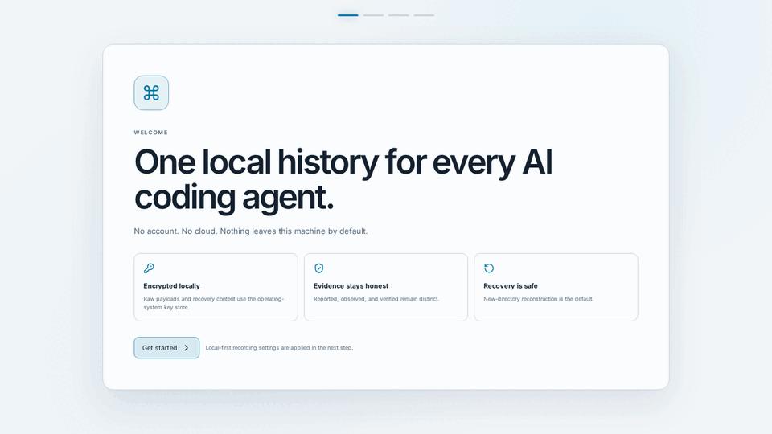
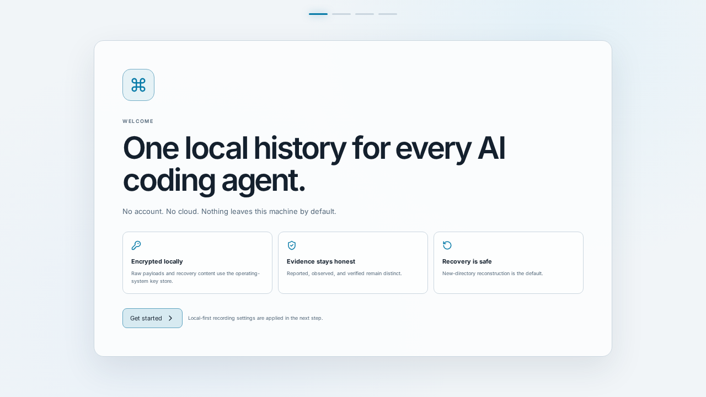
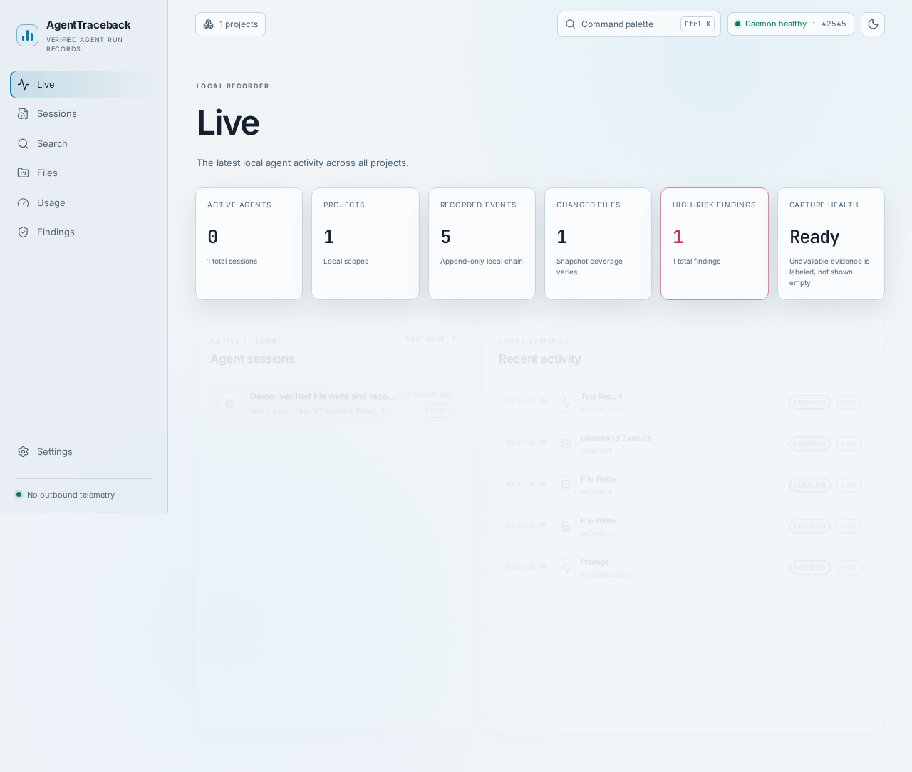
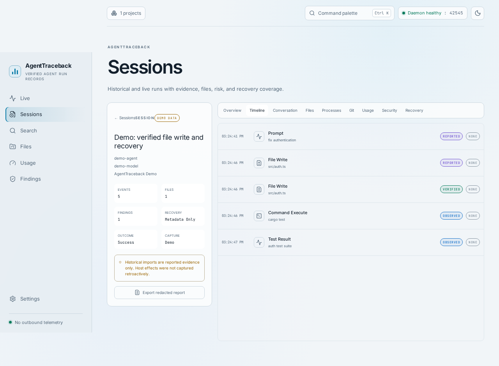
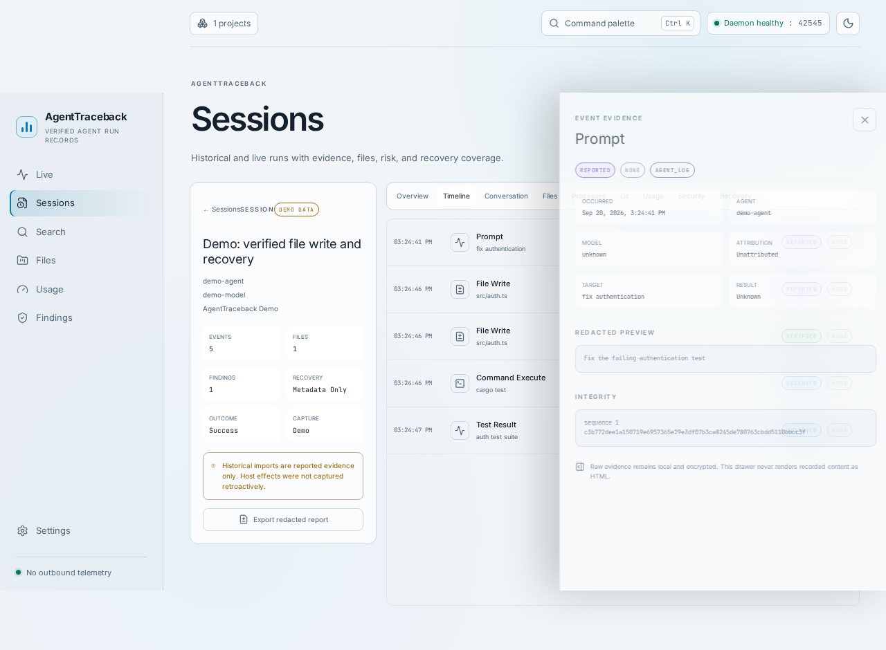
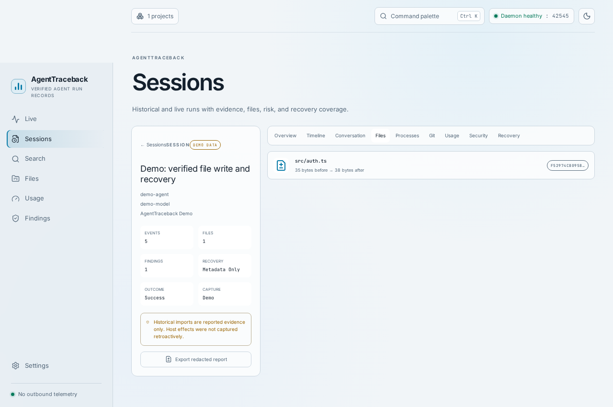
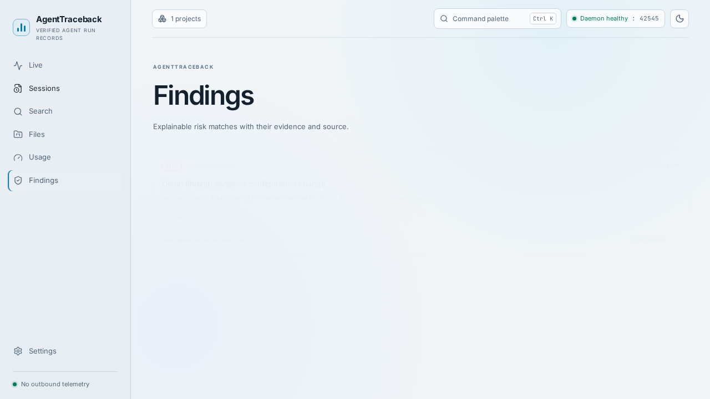
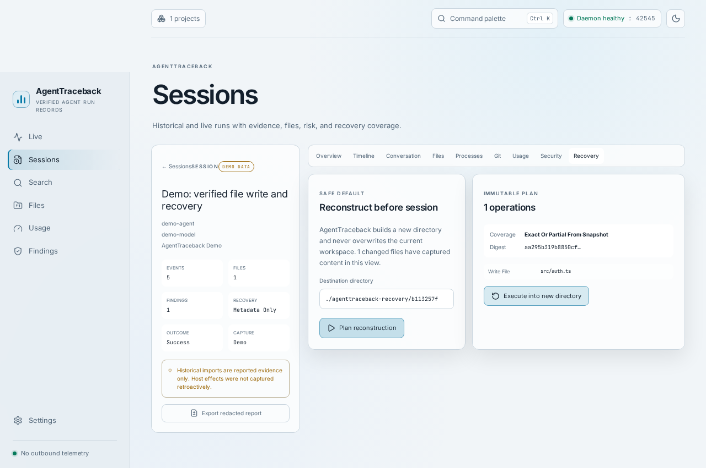

# AgentTraceback

**Every agent. Every action. One timeline.**



AgentTraceback is a local-first verified record and recovery tool for AI coding-agent
runs. It shows what an agent reported, what the host independently observed, what
changed, what was risky, and how to reconstruct earlier state safely. It is not a
guard, blocker, or generic activity dashboard.

> **Release status:** this repository is an internal v0.1 release candidate. The
> product UI, five semantic adapters, Command Code detection profile, encrypted
> storage, recovery, redacted exports, demo dataset, installers, startup management,
> and signed-update build hooks are implemented. Public `v0.1.0` remains gated on
> the seven-day soak, packaged-app smoke tests, and external signing credentials.

## Understand, Verify, Recover

- **Understand:** inspect one timeline across agents, projects, prompts, responses,
  tools, commands, file changes, Git boundaries, tests, findings, and recovery state.
- **Verify:** source evidence remains `REPORTED` or `OBSERVED`. Only an active,
  independent correlation can produce the `VERIFIED` projection.
- **Recover:** reconstruct pre-session state into a new directory by default, with
  digest checks, explicit exclusions, conflict protection, and an immutable plan.

## Supported Agents And Platforms

| Agent or target | Historical import | Live tail | Richer capture | Notes |
| --- | --- | --- | --- | --- |
| Claude Code | Implemented | Implemented | Optional reversible hooks | Hooks are off until explicitly approved. |
| Codex CLI | Implemented | Implemented | Reported logs plus host observation | Rollout JSONL parser. |
| Hermes Agent | Implemented | Implemented | Read-only SQLite state | Cursor follows increasing message row ID. |
| OpenCode | Implemented | Implemented | Read-only SQLite state | Cursor uses `time_created:message_id`. |
| Gemini CLI | Implemented | Implemented | JSON source discovery | Format drift is quarantined and visible. |
| Command Code | Detection-only | Generic wrapper | Generic wrapper | No stable semantic source is assumed. |
| Any CLI agent | Not applicable | Generic wrapper | Host observation | `agenttraceback run -- <command>` preserves PTY behavior and exit status. |

| Desktop target | Current packaging |
| --- | --- |
| Ubuntu 22.04-equivalent x86_64 | Tauri `.deb` and AppImage build path |
| Windows 10/11 x86_64 | Tauri NSIS/MSI build path |
| macOS 13+ universal | Tauri app/DMG build path, signed/notarized when credentials exist |

## Evidence Badges

| Badge | Meaning |
| --- | --- |
| `REPORTED` | An agent-controlled source says the event occurred. |
| `OBSERVED` | AgentTraceback independently observed an execution or machine effect. |
| `VERIFIED` | Independent reported and observed evidence matched under a versioned correlation rule. |

Two agent-controlled sources never verify each other. A historical import is
reported-only because the host effects were not captured retroactively.

## Installation

Prebuilt installers are produced by the release workflow. Credentials are external
inputs; an unsigned development build is not presented as a production release.

From source:

```bash
pnpm install
cargo install --path crates/agenttraceback-cli
cargo install --path crates/agenttraceback-daemon
cargo build --workspace --release
pnpm --filter @agenttraceback/desktop tauri build
```

Platform prerequisites follow Tauri 2. See [docs/release.md](docs/release.md) for
signing, notarization, updater-key, installer, and startup-management details.

## Two-Minute Quick Start

```bash
# Start the authenticated loopback daemon.
agenttraceback daemon start

# Optional: install a clearly labeled local sample dataset.
agenttraceback demo install

# Open the desktop product.
agenttraceback open
```

Record a new generic agent session:

```bash
agenttraceback run --project /path/to/project --agent codex -- codex
```

Import and inspect historical records:

```bash
agenttraceback adapters list
agenttraceback adapters import claude-code
agenttraceback sessions
agenttraceback show <session-id>
agenttraceback search 'path:src/auth evidence:verified'
agenttraceback verify --all
agenttraceback export <session-id> --format markdown
```

## Privacy

There is no account, API key, cloud database, hosted dashboard, or automatic
telemetry. The daemon binds only to `127.0.0.1`, requires a per-installation bearer
token, and rejects hostile browser origins. Raw payloads, transcripts, and recovery
content are encrypted locally. Searchable previews and default exports are redacted.
The only outbound runtime behavior is a user-initiated update check when a signed
release endpoint is configured; installing an update always remains user initiated.

## Capture Truth Table

| Capability | Standard mode | Deep Capture (post-v0.1) |
| --- | --- | --- |
| Wrapped top-level command and exit status | Exact | Exact |
| Agent prompts, responses, and tool semantics | Available when the adapter reports them | Available when reported |
| Project file creates, writes, deletes, and renames | Host observed | Host observed |
| Every file read | Not guaranteed | Potential provider capability |
| Every short-lived descendant process | Best effort | Potential provider capability |
| Network connections | Not observed in v0.1 | Potential provider capability |
| Git state at wrapper boundaries | Captured | Captured |
| Recovery coverage | Exact only for captured content | Same semantics, broader provider coverage |

Unavailable evidence is labeled unavailable and is never shown as an empty
successful capture.

## Screenshots

### Onboarding



### Live Dashboard



### Timeline



### Evidence Drawer



### File Diff



### Finding



### Recovery



## Architecture

The Rust workspace separates stable domain types, configuration, storage, crypto,
events, correlation, risk, projects, snapshots, recovery, search, export, adapters,
platform primitives, API, CLI, and daemon. The Tauri desktop communicates with the
daemon through the authenticated local API and never duplicates event logic.

Key documents:

- [Architecture overview](docs/architecture/overview.md)
- [Evidence model](docs/evidence-model.md)
- [Adapter contract](docs/architecture/adapter-contract.md)
- [Recovery model](docs/recovery-model.md)
- [Threat model](docs/threat-model.md)
- [Architecture decisions](docs/adr)

The store uses one SQLite writer, bounded readers, append-only event chains, FTS5,
encrypted content-addressed blobs, migration backups, and an explicit audited
deletion path. Adapter cursors advance only with durable imports. Recovery plans are
digest-bound and execute against revalidated canonical paths.

## Roadmap

Milestones 0 through 6 are implemented and exercised by Rust, Vitest, and Playwright
suites. Milestone 7 hardening and packaging are implemented with these launch gates
still requiring release evidence:

- Seven-day mixed-session soak.
- Packaged install/uninstall and reboot/login smoke tests on each platform.
- External Apple, Windows, and Tauri updater credentials.
- Final fixture-backed acceptance on hardware representing all three OS families.

Milestone 8 docs, demo mode, screenshots, launch GIF, and quick start are complete.
Post-v0.1 work remains intentionally deferred: additional adapters, MCP, shared
reports, OpenTelemetry, Deep Capture providers, Guard Mode, signed roots by default,
and team aggregation.

## Contributing, Security, And License

Read [CONTRIBUTING.md](CONTRIBUTING.md) before opening a change. Report security
issues according to [SECURITY.md](SECURITY.md). AgentTraceback is licensed under the
Apache License 2.0; see [LICENSE](LICENSE).
